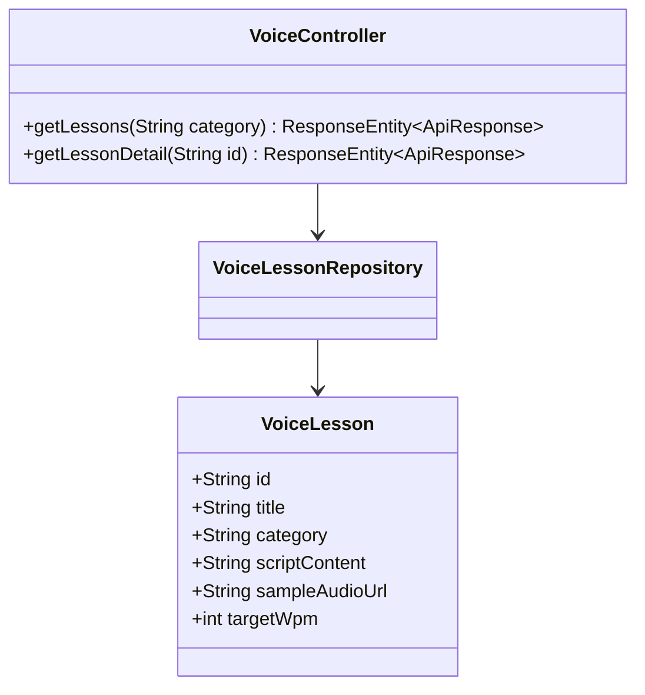
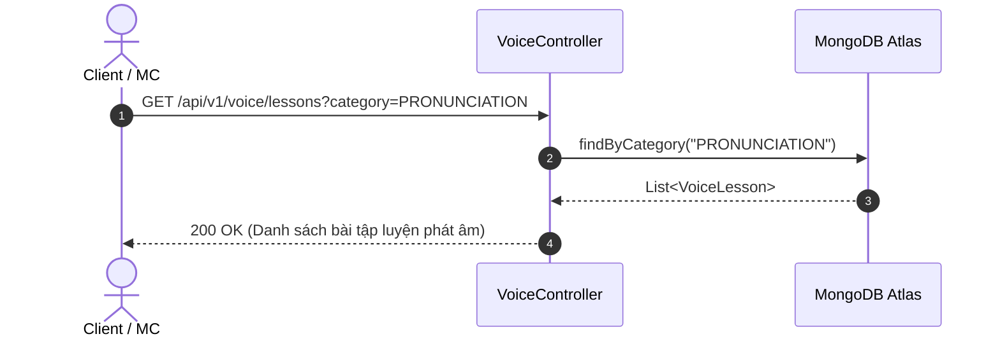

# UC-03.1 — Danh Sách & Chi Tiết Bài Luyện Giọng (Get Voice Lessons)

##  1. Bảng Mô Tả Nghiệp Vụ (Business Description Table)

| Mục | Chi Tiết Nghiệp Vụ |
|---|---|
| **Mã Use Case** | `UC-03.1` |
| **Tên Tính Năng** | Danh sách bài luyện giọng & Chi tiết văn bản đọc mẫu |
| **Actor Chính** | Guest / Client / MC |
| **Mục Tiêu** | Tra cứu các bài tập luyện giọng phân loại theo danh mục và xem kịch bản đọc mẫu |
| **API Endpoint** | `GET /api/v1/voice/lessons`, `GET /api/v1/voice/lessons/{id}` |
| **Tiền Điều Kiện** | Bài luyện tập tồn tại trong database |
| **Hậu Điều Kiện** | Trả về thông tin văn bản, audio mẫu và tiêu chuẩn WPM |
| **Quy Tắc Nghiệp Vụ** | Phân loại theo category: `PRONUNCIATION`, `ARTICULATION`, `EMPHASIS`, `EMOTION` |
| **Các Mã Lỗi Có Thể Gặp** | `LESSON_NOT_FOUND` (404) |

---

##  2. Class Diagram

---

##  3. Sequence Diagram

---

##  4. Testing & Verification Report

- **Test Suite Class:** `com.mchub.controllers.VoiceControllerTest`
- **Method Kiểm Thử:** `getLessons_returnsCategoryLessons()`
- **Assertions:** Trả về danh sách `VoiceLesson` đúng category.
