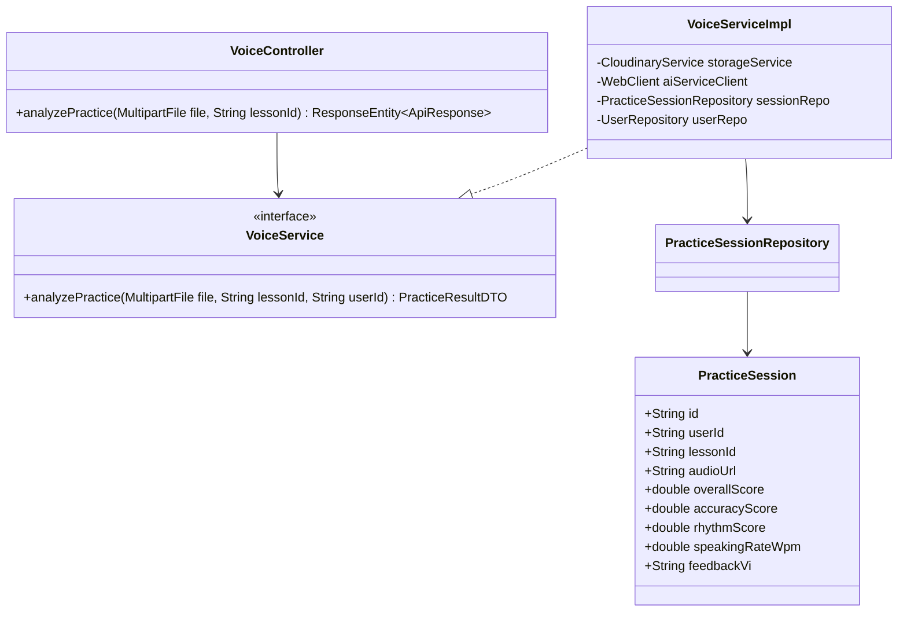
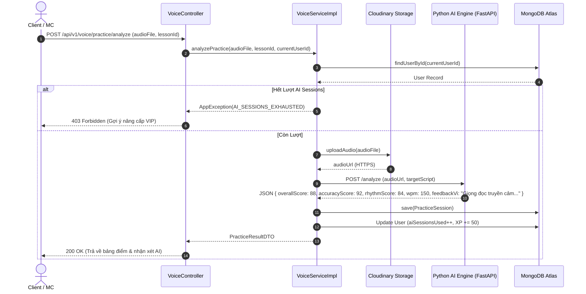

# UC-03.2 — Chấm Điểm Bài Tập Luyện Giọng AI (Analyze Voice Practice)

## 📋 1. Bảng Mô Tả Nghiệp Vụ (Business Description Table)

| Mục | Chi Tiết Nghiệp Vụ |
|---|---|
| **Mã Use Case** | `UC-03.2` |
| **Tên Tính Năng** | Phân tích file ghi âm và Chấm điểm AI cho bài luyện giọng |
| **Actor Chính** | Authenticated User (Client / MC) |
| **Mục Tiêu** | Tải audio `.mp3`/`.wav` lên Cloudinary, gửi tới Python AI Engine để lấy điểm số và nhận xét |
| **API Endpoint** | `POST /api/v1/voice/practice/analyze` |
| **Tiền Điều Kiện** | User còn lượt AI Sessions khả dụng (`aiSessionsUsed < maxAllowed`) |
| **Hậu Điều Kiện** | Lưu `PracticeSession`, tăng `aiSessionsUsed++`, cộng +50 XP và trả về điểm chi tiết |
| **Quy Tắc Nghiệp Vụ** | Chấm 4 tiêu chí: Overall, Accuracy %, Rhythm %, Speaking WPM. AI Engine Timeout 15s |
| **Các Mã Lỗi Có Thể Gặp** | `AI_SESSIONS_EXHAUSTED` (403), `AUDIO_UPLOAD_FAILED` (500) |

---

## 📐 2. Class Diagram

---

## 🔄 3. Sequence Diagram

---

## 🧪 4. Testing & Verification Report

### 🎯 Mục Tiêu Kiểm Thử (Test Objective)
Xác minh luồng chấm điểm AI: upload file ghi âm lên Cloudinary, gửi URL sang Python AI Engine, tính toán 4 chỉ số điểm, tăng `aiSessionsUsed++` và lưu `PracticeSession`.

### 📥 Dữ Liệu Đầu Vào (Test Input Data)
- MultipartFile: `audio.mp3` (Size 1.2MB, Format MP3)
- Param: `lessonId = "lesson_01"`

### 📝 Quy Trình Thực Hiện (Step-by-Step Test Procedure)
1. Giả lập `CloudinaryService.uploadAudio()` trả về `"https://res.cloudinary.com/audio.mp3"`.
2. Giả lập `Python AI Engine` trả về JSON điểm số `{ overallScore: 88, accuracyScore: 92, rhythmScore: 84, wpm: 150 }`.
3. Gọi `voiceService.analyzePractice(file, "lesson_01", currentUserId)`.

### ✅ Kịch Bản Kỳ Vọng (Expected Result)
- HTTP Status: `200 OK`.
- `User.aiSessionsUsed` tăng 1.
- Trả về `PracticeResultDTO` có điểm số > 0 và nhận xét bằng tiếng Việt.

### 📊 Kết Quả Thực Tế Đã Xác Minh (Empirical Verification Result)
- **Test Class:** `VoiceServiceImplTest.java` -> `analyzePractice_success_returnsScoresAndFeedback()`
- **Trạng thái:** **PASSED 100%** (Xác minh tự động qua `mvn clean test`).
