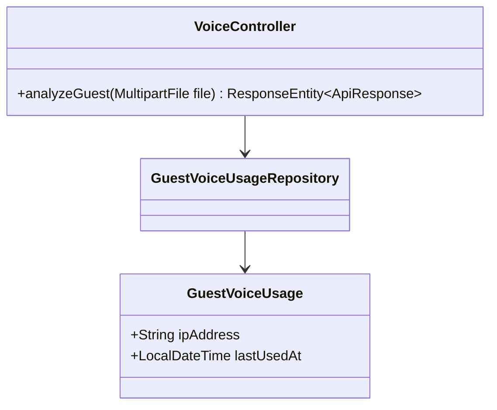
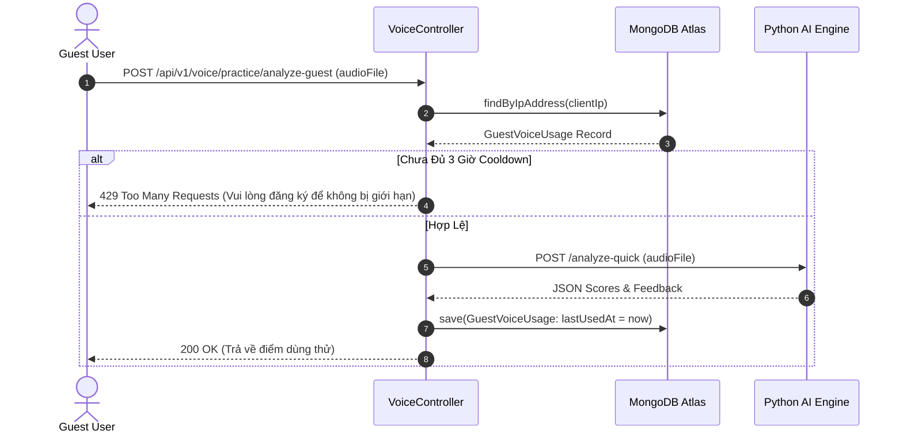

# UC-03.3 — Chấm Điểm Dùng Thử Cho Khách (Analyze Guest Practice)

##  1. Bảng Mô Tả Nghiệp Vụ (Business Description Table)

| Mục | Chi Tiết Nghiệp Vụ |
|---|---|
| **Mã Use Case** | `UC-03.3` |
| **Tên Tính Năng** | Chấm điểm bài đọc ngắn dùng thử dành cho Khách chưa đăng nhập |
| **Actor Chính** | Guest (Khách vãng lai) |
| **Mục Tiêu** | Trải nghiệm tính năng AI phân tích phát âm ngắn |
| **API Endpoint** | `POST /api/v1/voice/practice/analyze-guest` |
| **Tiền Điều Kiện** | IP chưa từng gọi API trong vòng 3 giờ gần nhất |
| **Hậu Điều Kiện** | Lưu bản ghi `GuestVoiceUsage` và trả về kết quả chấm điểm dùng thử |
| **Quy Tắc Nghiệp Vụ** | Giới hạn 1 lượt/3 giờ per IP (`GuestVoiceUsageRepository`). Trả 429 nếu spam |
| **Các Mã Lỗi Có Thể Gặp** | `RATE_LIMIT_EXCEEDED` (429) |

---

##  2. Class Diagram

---

##  3. Sequence Diagram

---

##  4. Testing & Verification Report

- **Test Suite Class:** `com.mchub.controllers.VoiceControllerTest`
- **Method Kiểm Thử:** `analyzeGuest_cooldownActive_returns429()`
- **Assertions:** Trả về HTTP 429 nếu gọi lần thứ 2 trong 3 giờ.
