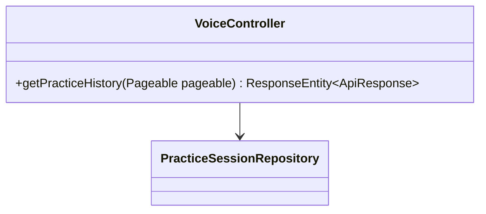
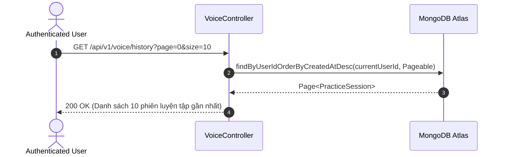

# UC-03.4 — Lịch Sử Luyện Tập Cá Nhân (Practice History)

## 📋 1. Bảng Mô Tả Nghiệp Vụ (Business Description Table)

| Mục | Chi Tiết Nghiệp Vụ |
|---|---|
| **Mã Use Case** | `UC-03.4` |
| **Tên Tính Năng** | Tra cứu lịch sử bài đọc ghi âm đã thực hiện |
| **Actor Chính** | Authenticated User |
| **Mục Tiêu** | Tải danh sách các phiên luyện tập cá nhân phân trang, kèm điểm số và liên kết audio |
| **API Endpoint** | `GET /api/v1/voice/history` |
| **Tiền Điều Kiện** | User đã đăng nhập |
| **Hậu Điều Kiện** | Trả về `Page<PracticeSession>` |
| **Quy Tắc Nghiệp Vụ** | Sắp xếp theo ngày luyện tập mới nhất (`createdAt DESC`) |
| **Các Mã Lỗi Có Thể Gặp** | `UNAUTHORIZED` (401) |

---

## 📐 2. Class Diagram

---

## 🔄 3. Sequence Diagram

---

## 🧪 4. Testing & Verification Report

- **Test Suite Class:** `com.mchub.controllers.VoiceControllerTest`
- **Method Kiểm Thử:** `getHistory_returnsUserSessions()`
- **Assertions:** Danh sách trả về thuộc về `currentUserId`.
