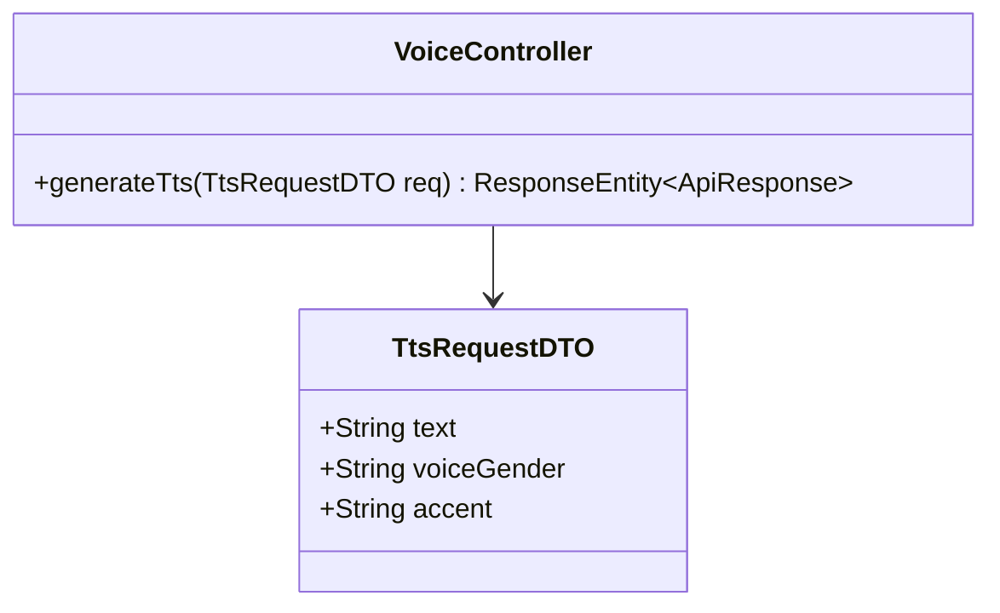
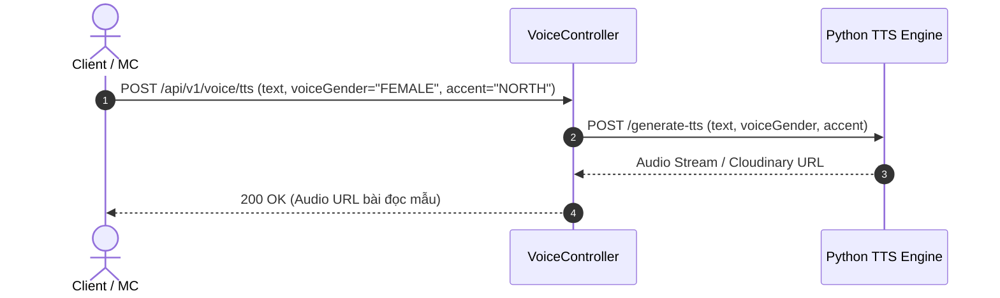

# UC-03.5 — Phát Tạo Âm Thanh TTS Mẫu (Generate Text-To-Speech)

## 📋 1. Bảng Mô Tả Nghiệp Vụ (Business Description Table)

| Mục | Chi Tiết Nghiệp Vụ |
|---|---|
| **Mã Use Case** | `UC-03.5` |
| **Tên Tính Năng** | Chuyển đổi văn bản thành âm thanh đọc mẫu chuẩn MC (Text-To-Speech) |
| **Actor Chính** | Client / MC / Admin |
| **Mục Tiêu** | Tạo file âm thanh đọc mẫu cho bài đọc bất kỳ qua Python TTS AI |
| **API Endpoint** | `POST /api/v1/voice/tts` |
| **Tiền Điều Kiện** | Văn bản không rỗng và dài không quá 1000 từ |
| **Hậu Điều Kiện** | Trả về HTTPS Audio URL |
| **Quy Tắc Nghiệp Vụ** | Hỗ trợ chọn giọng Nam/Nữ và Giọng Bắc/Nam |
| **Các Mã Lỗi Có Thể Gặp** | `VALIDATION_FAILED` (400), `TTS_SERVICE_FAILED` (500) |

---

## 📐 2. Class Diagram

---

## 🔄 3. Sequence Diagram

---

## 🧪 4. Testing & Verification Report

- **Test Suite Class:** `com.mchub.controllers.VoiceControllerTest`
- **Method Kiểm Thử:** `generateTts_validText_returnsAudioUrl()`
- **Assertions:** Trả về Audio URL có đuôi `.mp3`.
