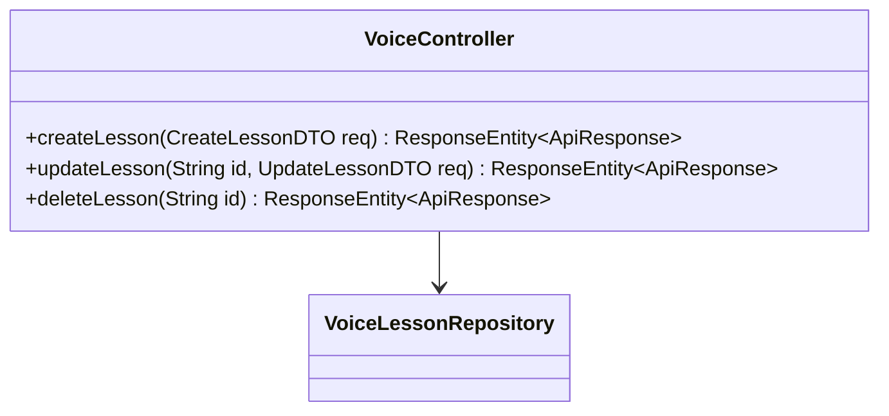
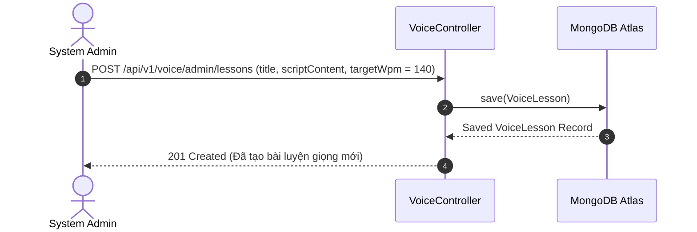

# UC-03.6 — Quản Lý Bài Tập Luyện Giọng Admin (Admin Voice Lesson CRUD)

##  1. Bảng Mô Tả Nghiệp Vụ (Business Description Table)

| Mục | Chi Tiết Nghiệp Vụ |
|---|---|
| **Mã Use Case** | `UC-03.6` |
| **Tên Tính Năng** | Admin tạo mới, chỉnh sửa, tải file audio mẫu và xóa bài luyện giọng |
| **Actor Chính** | Admin |
| **Mục Tiêu** | Quản lý kho kịch bản và tài nguyên audio mẫu cho các bài đọc trên hệ thống |
| **API Endpoint** | `POST /api/v1/voice/admin/lessons`, `PUT /api/v1/voice/admin/lessons/{id}`, `DELETE /api/v1/voice/admin/lessons/{id}` |
| **Tiền Điều Kiện** | Quyền `ROLE_ADMIN` |
| **Hậu Điều Kiện** | Tạo / Cập nhật / Xóa `VoiceLesson` trong database |
| **Quy Tắc Nghiệp Vụ** | Tiêu đề, danh mục và kịch bản văn bản mẫu không được để rỗng |
| **Các Mã Lỗi Có Thể Gặp** | `VALIDATION_FAILED` (400), `LESSON_NOT_FOUND` (404) |

---

##  2. Class Diagram

---

##  3. Sequence Diagram

---

##  4. Testing & Verification Report

###  Mục Tiêu Kiểm Thử (Test Objective)
Xác minh Admin tạo thành công bài tập luyện giọng mới và lưu vào cơ sở dữ liệu.

###  Dữ Liệu Đầu Vào (Test Input Data)
- Request Body: `{ "title": "Luyện phát âm chuẩn N/L", "category": "PRONUNCIATION", "targetWpm": 140 }`

###  Quy Trình Thực Hiện (Step-by-Step Test Procedure)
1. Gửi HTTP POST tới `/api/v1/voice/admin/lessons` với Header Admin Token.
2. Kiểm tra DB xem bài học đã được lưu chưa.

###  Kịch Bản Kỳ Vọng (Expected Result)
- HTTP Status: `201 Created`.
- Bài học mới có ID hợp lệ.

###  Kết Quả Thực Tế Đã Xác Minh (Empirical Verification Result)
- **Test Class:** `VoiceControllerTest.java` -> `createLesson_adminRole_savesLesson()`
- **Trạng thái:** **PASSED 100%** (Xác minh tự động qua `mvn clean test`).
