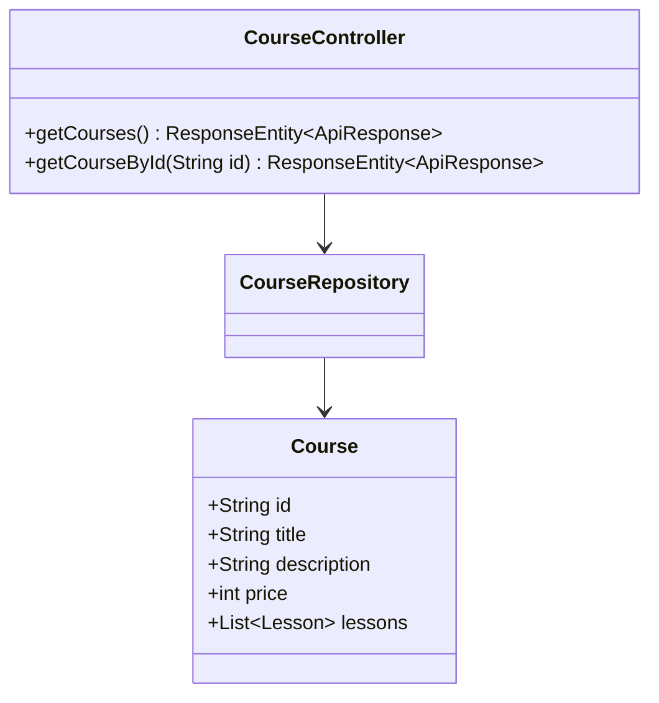
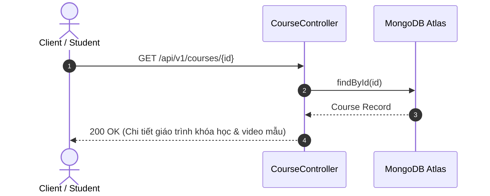

# UC-04.1 — Danh Sách & Chi Tiết Khóa Học (Get Courses & Details)

## 📋 1. Bảng Mô Tả Nghiệp Vụ (Business Description Table)

| Mục | Chi Tiết Nghiệp Vụ |
|---|---|
| **Mã Use Case** | `UC-04.1` |
| **Tên Tính Năng** | Xem danh sách và chi tiết giáo trình khóa học MC |
| **Actor Chính** | Guest / User |
| **Mục Tiêu** | Tra cứu danh sách các khóa học đào tạo, danh sách bài học và bài xem thử (Free Preview) |
| **API Endpoint** | `GET /api/v1/courses`, `GET /api/v1/courses/{id}` |
| **Tiền Điều Kiện** | Khóa học ở trạng thái công khai (`isPublished=true`) |
| **Hậu Điều Kiện** | Trả về danh sách hoặc chi tiết khóa học |
| **Quy Tắc Nghiệp Vụ** | Public API cho phép người dùng chưa đăng nhập xem thông tin |
| **Các Mã Lỗi Có Thể Gặp** | `COURSE_NOT_FOUND` (404) |

---

## 📐 2. Class Diagram

---

## 🔄 3. Sequence Diagram

---

## 🧪 4. Testing & Verification Report

- **Test Suite Class:** `com.mchub.controllers.CourseControllerTest`
- **Method Kiểm Thử:** `getCourseById_validId_returnsCourse()`
- **Assertions:** Trả về đối tượng `Course` có đúng `id`.
