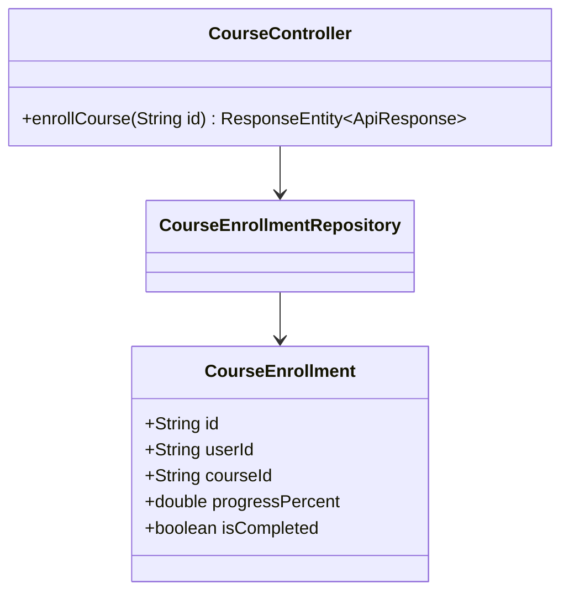
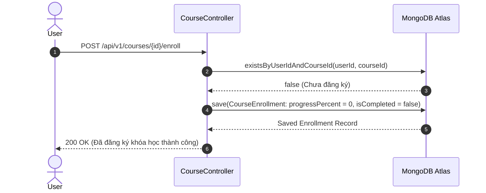

# UC-04.2 — Đăng Ký & Mua Khóa Học (Enroll Course)

##  1. Bảng Mô Tả Nghiệp Vụ (Business Description Table)

| Mục | Chi Tiết Nghiệp Vụ |
|---|---|
| **Mã Use Case** | `UC-04.2` |
| **Tên Tính Năng** | Đăng ký khóa học đào tạo |
| **Actor Chính** | Authenticated User |
| **Mục Tiêu** | Tạo bản ghi `CourseEnrollment` cho phép học viên truy cập toàn bộ bài học |
| **API Endpoint** | `POST /api/v1/courses/{id}/enroll` |
| **Tiền Điều Kiện** | User chưa đăng ký khóa học này trước đó |
| **Hậu Điều Kiện** | Lưu `CourseEnrollment` với tiến độ ban đầu = `0%` |
| **Quy Tắc Nghiệp Vụ** | Thành viên có gói VIP FULL/ANNUAL được đăng ký miễn phí |
| **Các Mã Lỗi Có Thể Gặp** | `ALREADY_ENROLLED` (400), `PAYMENT_REQUIRED` (402) |

---

##  2. Class Diagram

---

##  3. Sequence Diagram

---

##  4. Testing & Verification Report

- **Test Suite Class:** `com.mchub.services.impl.CourseServiceImplTest`
- **Method Kiểm Thử:** `enroll_success()`
- **Assertions:** Bản ghi `CourseEnrollment` được tạo với tiến độ `0%`.
