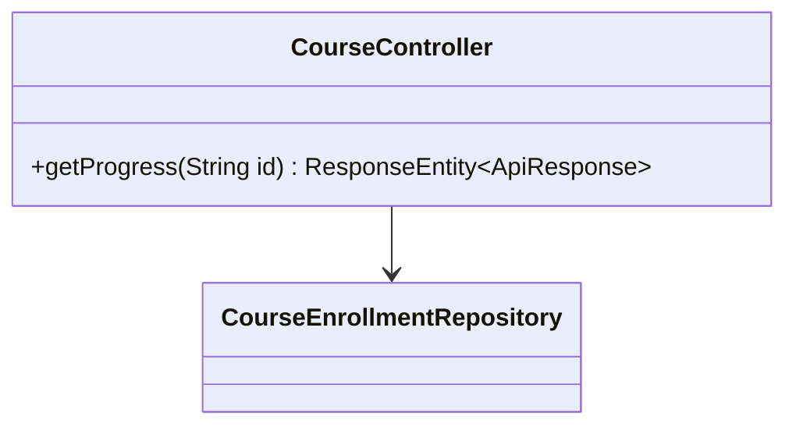
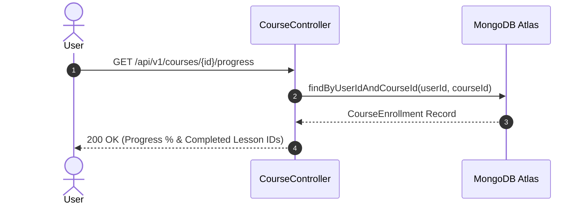

# UC-04.3 — Theo Dõi Tiến Độ Học Tập (Course Progress)

## 📋 1. Bảng Mô Tả Nghiệp Vụ (Business Description Table)

| Mục | Chi Tiết Nghiệp Vụ |
|---|---|
| **Mã Use Case** | `UC-04.3` |
| **Tên Tính Năng** | Tra cứu tiến độ học tập cá nhân trong khóa học |
| **Actor Chính** | Authenticated User |
| **Mục Tiêu** | Lấy phần trăm tiến độ (`progressPercent`) và danh sách ID các bài học đã xong |
| **API Endpoint** | `GET /api/v1/courses/{id}/progress` |
| **Tiền Điều Kiện** | User đã đăng ký khóa học này (`CourseEnrollment` tồn tại) |
| **Hậu Điều Kiện** | Trả về DTO thông tin tiến độ |
| **Quy Tắc Nghiệp Vụ** | % tiến độ = (Số bài đã học / Tổng số bài) * 100 |
| **Các Mã Lỗi Có Thể Gặp** | `NOT_ENROLLED` (403) |

---

## 📐 2. Class Diagram

---

## 🔄 3. Sequence Diagram

---

## 🧪 4. Testing & Verification Report

- **Test Suite Class:** `com.mchub.controllers.CourseControllerTest`
- **Method Kiểm Thử:** `getProgress_returnsCurrentProgress()`
- **Assertions:** Tiến độ % tính chính xác theo số bài học hoàn thành.
