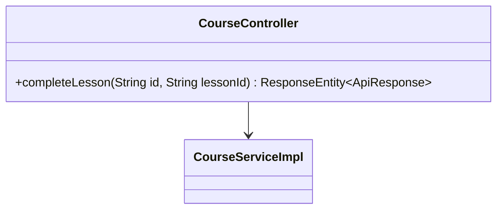
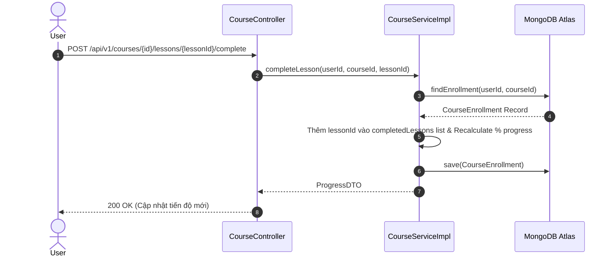

# UC-04.4 — Hoàn Thành Bài Học Video (Complete Lesson)

## 📋 1. Bảng Mô Tả Nghiệp Vụ (Business Description Table)

| Mục | Chi Tiết Nghiệp Vụ |
|---|---|
| **Mã Use Case** | `UC-04.4` |
| **Tên Tính Năng** | Đánh dấu hoàn thành 1 bài học video/đọc |
| **Actor Chính** | Authenticated User |
| **Mục Tiêu** | Thêm `lessonId` vào danh sách `completedLessons` và tính toán lại % tiến độ |
| **API Endpoint** | `POST /api/v1/courses/{id}/lessons/{lessonId}/complete` |
| **Tiền Điều Kiện** | User đã đăng ký khóa học |
| **Hậu Điều Kiện** | Cập nhật `CourseEnrollment` trong DB |
| **Quy Tắc Nghiệp Vụ** | Nếu học bài đã xong trước đó, giữ nguyên % tiến độ |
| **Các Mã Lỗi Có Thể Gặp** | `LESSON_NOT_FOUND` (404), `NOT_ENROLLED` (403) |

---

## 📐 2. Class Diagram

---

## 🔄 3. Sequence Diagram

---

## 🧪 4. Testing & Verification Report

- **Test Suite Class:** `com.mchub.services.impl.CourseServiceImplTest`
- **Method Kiểm Thử:** `completeLesson_updatesProgressPercent()`
- **Assertions:** Số lượng bài hoàn thành tăng 1, tiến độ % được cộng thêm.
