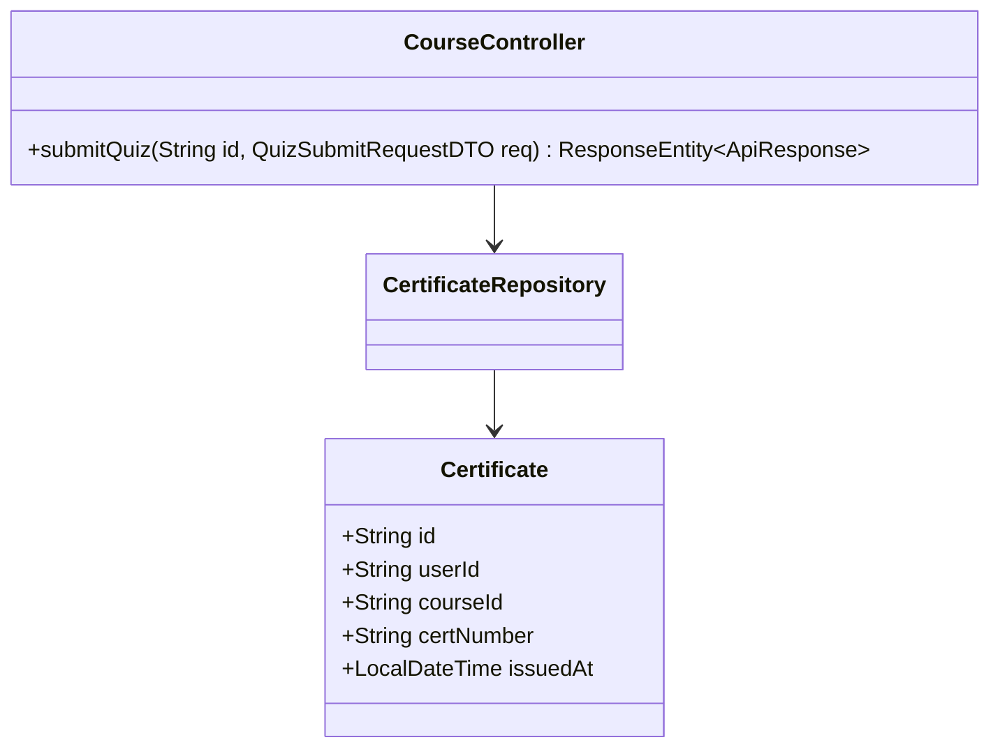
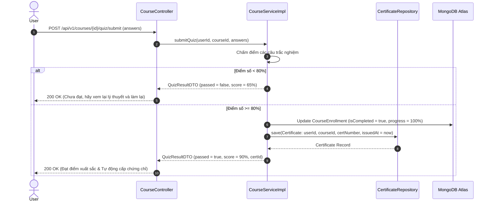

# UC-04.5 — Nộp Bài Quiz & Auto Certificate (Submit Quiz & Auto Cert)

## 📋 1. Bảng Mô Tả Nghiệp Vụ (Business Description Table)

| Mục | Chi Tiết Nghiệp Vụ |
|---|---|
| **Mã Use Case** | `UC-04.5` |
| **Tên Tính Năng** | Nộp bài Quiz kiểm tra cuối khóa và Tự động cấp chứng chỉ hoàn thành |
| **Actor Chính** | Authenticated User |
| **Mục Tiêu** | Chấm điểm bài Quiz trắc nghiệm. Nếu đạt >= 80%, đánh dấu `isCompleted=true` và sinh `Certificate` |
| **API Endpoint** | `POST /api/v1/courses/{id}/quiz/submit` |
| **Tiền Điều Kiện** | User đã học đủ các bài trong khóa học trước khi làm bài Quiz |
| **Hậu Điều Kiện** | Nếu đạt, tạo bản ghi `Certificate` mới và cập nhật `isCompleted=true` |
| **Quy Tắc Nghiệp Vụ** | Điểm đậu >= 80%. Nếu không đạt được phép làm lại |
| **Các Mã Lỗi Có Thể Gặp** | `QUIZ_FAILED` (200 - pass=false), `INVALID_ANSWERS` (400) |

---

## 📐 2. Class Diagram

---

## 🔄 3. Sequence Diagram

---

## 🧪 4. Testing & Verification Report

- **Test Suite Class:** `com.mchub.services.impl.CourseServiceImplTest`
- **Method Kiểm Thử:** `submitQuiz_passed_createsCertificate()`
- **Assertions:** Tạo chứng chỉ mới khi điểm >= 80, gán đúng `courseId` và `userId`.
