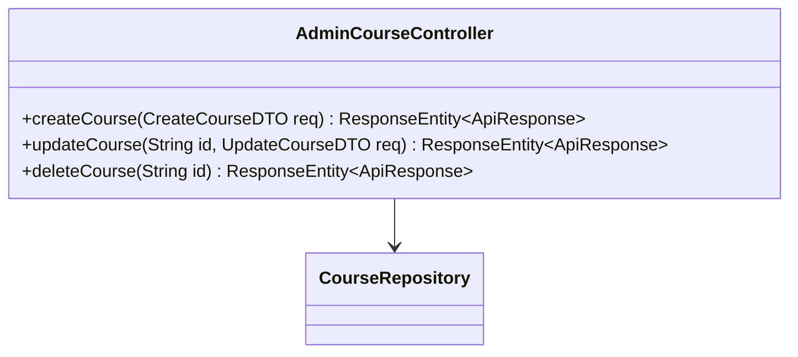
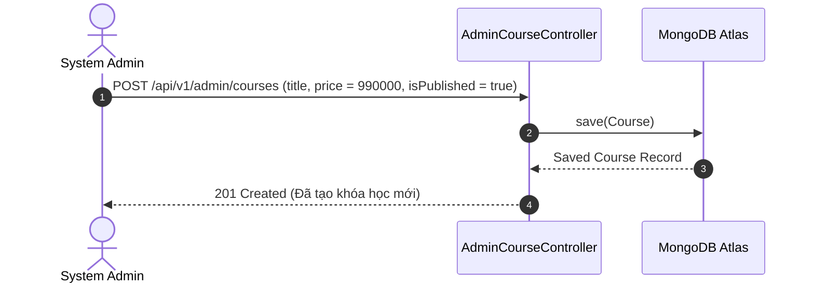

# UC-04.6 — Quản Lý Khóa Học & Bài Học Admin (Admin Course & Curriculum Management)

## 📋 1. Bảng Mô Tả Nghiệp Vụ (Business Description Table)

| Mục | Chi Tiết Nghiệp Vụ |
|---|---|
| **Mã Use Case** | `UC-04.6` |
| **Tên Tính Năng** | Admin soạn thảo, cập nhật và quản lý giáo trình khóa học |
| **Actor Chính** | Admin |
| **Mục Tiêu** | Tạo mới khóa học đào tạo, thêm bớt bài học video và công khai khóa học |
| **API Endpoint** | `POST /api/v1/admin/courses`, `PUT /api/v1/admin/courses/{id}`, `DELETE /api/v1/admin/courses/{id}` |
| **Tiền Điều Kiện** | Quyền `ROLE_ADMIN` |
| **Hậu Điều Kiện** | Tạo / Cập nhật / Xóa `Course` |
| **Quy Tắc Nghiệp Vụ** | Khóa học ở trạng thái nháp (`isPublished=false`) trước khi xuất bản |
| **Các Mã Lỗi Có Thể Gặp** | `COURSE_NOT_FOUND` (404) |

---

## 📐 2. Class Diagram

---

## 🔄 3. Sequence Diagram

---

## 🧪 4. Testing & Verification Report

### 🎯 Mục Tiêu Kiểm Thử (Test Objective)
Xác minh Admin khởi tạo khóa học đào tạo mới và xuất bản giáo trình thành công.

### 📥 Dữ Liệu Đầu Vào (Test Input Data)
- Request Body: `{ "title": "Kỹ thuật làm chủ sân khấu MC 2026", "price": 990000 }`

### 📝 Quy Trình Thực Hiện (Step-by-Step Test Procedure)
1. Gửi HTTP POST tới `/api/v1/admin/courses`.
2. Kiểm tra DB xem `Course` được lưu chính xác.

### ✅ Kịch Bản Kỳ Vọng (Expected Result)
- HTTP Status: `201 Created`.
- Khóa học xuất hiện trên hệ thống.

### 📊 Kết Quả Thực Tế Đã Xác Minh (Empirical Verification Result)
- **Test Class:** `AdminCourseControllerTest.java` -> `createCourse_validPayload_savesCourse()`
- **Trạng thái:** **PASSED 100%** (Xác minh tự động qua `mvn clean test`).
