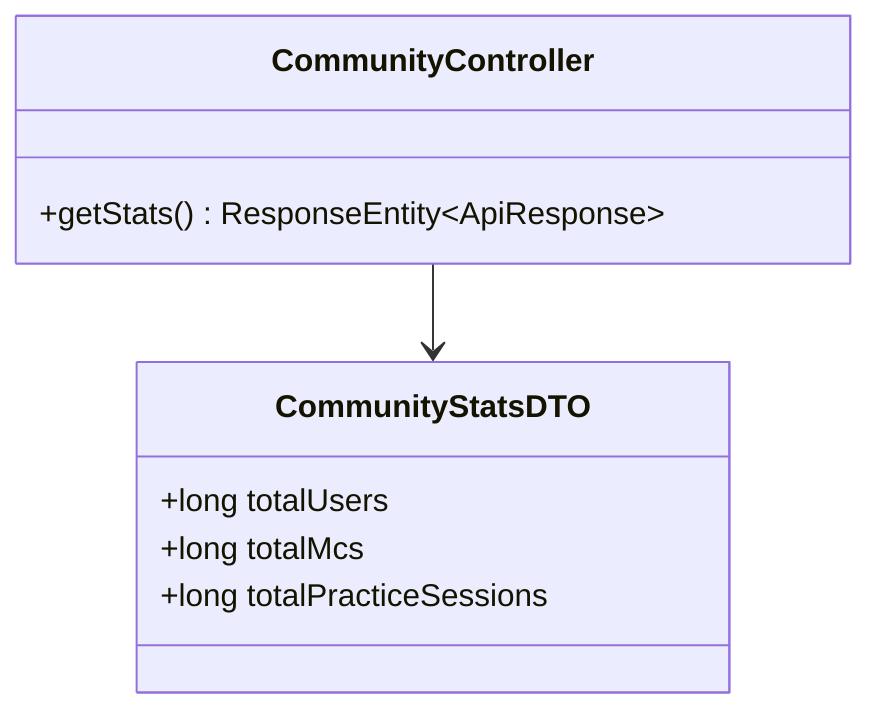
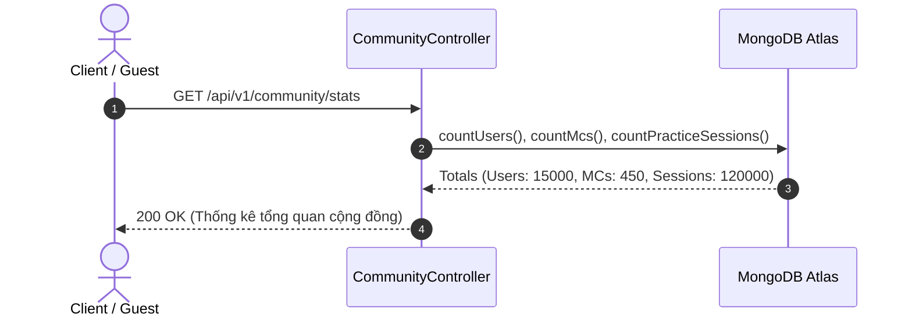

# UC-05.1 — Thống Kê Tổng Quan Cộng Đồng (Community Stats)

##  1. Bảng Mô Tả Nghiệp Vụ (Business Description Table)

| Mục | Chi Tiết Nghiệp Vụ |
|---|---|
| **Mã Use Case** | `UC-05.1` |
| **Tên Tính Năng** | Xem tổng quan chỉ số hoạt động cộng đồng |
| **Actor Chính** | Guest / User |
| **Mục Tiêu** | Trả về số lượng tổng thành viên, số MC Talent và số lượt luyện giọng đã hoàn thành |
| **API Endpoint** | `GET /api/v1/community/stats` |
| **Tiền Điều Kiện** | Không có |
| **Hậu Điều Kiện** | Trả về `CommunityStatsDTO` |
| **Quy Tắc Nghiệp Vụ** | Public API tra cứu nhanh |
| **Các Mã Lỗi Có Thể Gặp** | Không có |

---

##  2. Class Diagram

---

##  3. Sequence Diagram

---

##  4. Testing & Verification Report

- **Test Suite Class:** `com.mchub.controllers.CommunityControllerTest`
- **Method Kiểm Thử:** `getStats_returnsAggregatedTotals()`
- **Assertions:** Trả về các tổng số > 0.
