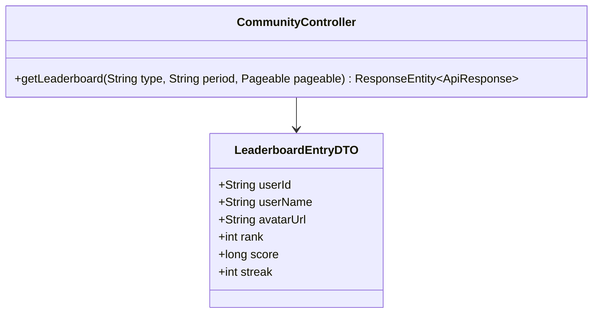
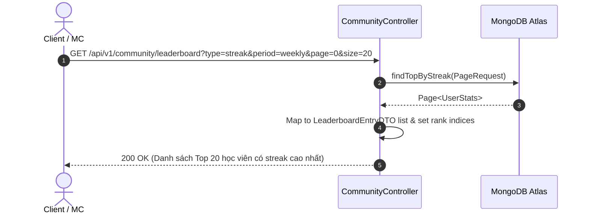

# UC-05.2 — Bảng Xếp Hạng Leaderboard (Leaderboard Ranking)

##  1. Bảng Mô Tả Nghiệp Vụ (Business Description Table)

| Mục | Chi Tiết Nghiệp Vụ |
|---|---|
| **Mã Use Case** | `UC-05.2` |
| **Tên Tính Năng** | Xem bảng xếp hạng thi đua phân trang |
| **Actor Chính** | User |
| **Mục Tiêu** | Lấy danh sách Top học viên phân trang theo tiêu chí (`streak`, `precision`, `sessions`) và thời gian (`weekly`, `all_time`) |
| **API Endpoint** | `GET /api/v1/community/leaderboard` |
| **Tiền Điều Kiện** | User đã đăng nhập |
| **Hậu Điều Kiện** | Trả về `Page<LeaderboardEntryDTO>` |
| **Quy Tắc Nghiệp Vụ** | Sắp xếp giảm dần theo giá trị chỉ số requested |
| **Các Mã Lỗi Có Thể Gặp** | `INVALID_FILTER_TYPE` (400) |

---

##  2. Class Diagram

---

##  3. Sequence Diagram

---

##  4. Testing & Verification Report

- **Test Suite Class:** `com.mchub.services.impl.CommunityServiceImplTest`
- **Method Kiểm Thử:** `getLeaderboard_streak_returnsRankedList()`
- **Assertions:** Danh sách trả về được sắp xếp giảm dần theo chỉ số requested.
