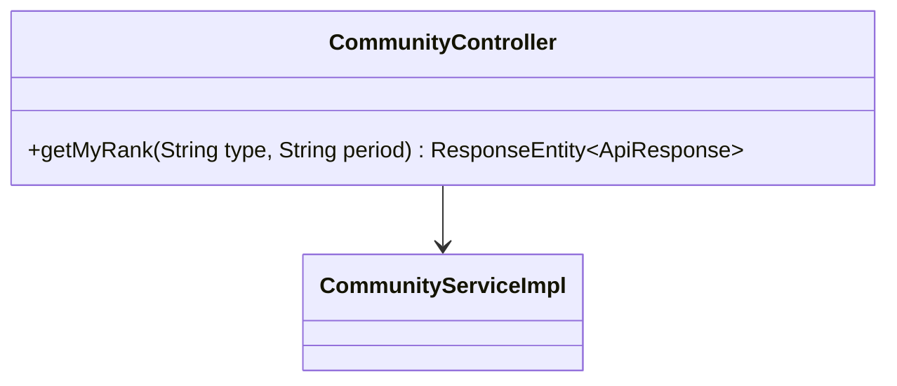
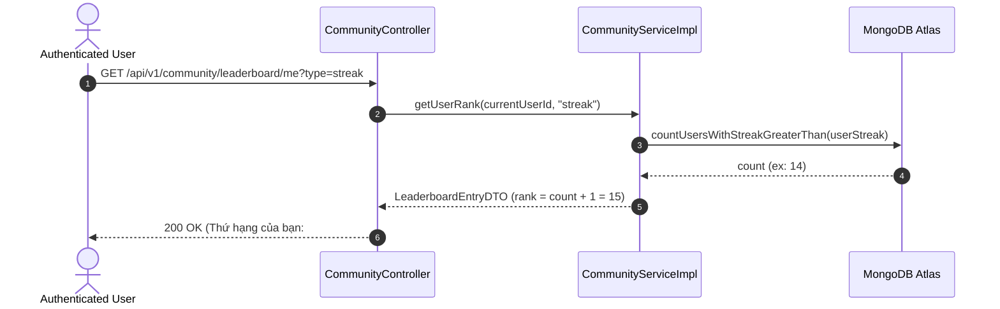

# UC-05.3 — Tra Cứu Thứ Hạng Cá Nhân (My Rank Position)

##  1. Bảng Mô Tả Nghiệp Vụ (Business Description Table)

| Mục | Chi Tiết Nghiệp Vụ |
|---|---|
| **Mã Use Case** | `UC-05.3` |
| **Tên Tính Năng** | Tra cứu vị trí xếp hạng cá nhân |
| **Actor Chính** | User |
| **Mục Tiêu** | Đếm và trả về vị trí đứng thứ bao nhiêu của chính mình trên toàn hệ thống |
| **API Endpoint** | `GET /api/v1/community/leaderboard/me` |
| **Tiền Điều Kiện** | User đã đăng nhập |
| **Hậu Điều Kiện** | Trả về `LeaderboardEntryDTO` của chính user |
| **Quy Tắc Nghiệp Vụ** | Vị trí = (Số người có điểm cao hơn) + 1 |
| **Các Mã Lỗi Có Thể Gặp** | `UNAUTHORIZED` (401) |

---

##  2. Class Diagram

---

##  3. Sequence Diagram

---

##  4. Testing & Verification Report

- **Test Suite Class:** `com.mchub.services.impl.CommunityServiceImplTest`
- **Method Kiểm Thử:** `getMyRank_validUser_returnsUserPosition()`
- **Assertions:** Trả về vị trí rank hợp lệ >= 1.
