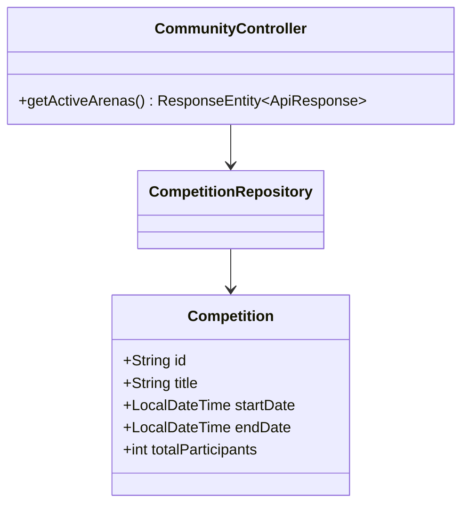
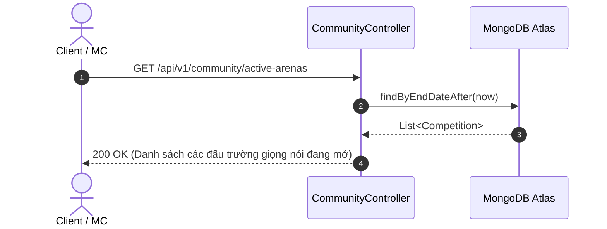

# UC-05.4 — Đấu Trường Giọng Nói (Active Voice Arenas)

##  1. Bảng Mô Tả Nghiệp Vụ (Business Description Table)

| Mục | Chi Tiết Nghiệp Vụ |
|---|---|
| **Mã Use Case** | `UC-05.4` |
| **Tên Tính Năng** | Danh sách các cuộc thi đấu trường giọng nói đang mở |
| **Actor Chính** | User |
| **Mục Tiêu** | Lấy danh sách các arena/cuộc thi đang trong thời gian diễn ra |
| **API Endpoint** | `GET /api/v1/community/active-arenas` |
| **Tiền Điều Kiện** | Cuộc thi có `endDate > now` |
| **Hậu Điều Kiện** | Trả về `List<Competition>` |
| **Quy Tắc Nghiệp Vụ** | Sắp xếp theo ngày kết thúc gần nhất |
| **Các Mã Lỗi Có Thể Gặp** | Không có |

---

##  2. Class Diagram

---

##  3. Sequence Diagram

---

##  4. Testing & Verification Report

- **Test Suite Class:** `com.mchub.controllers.CommunityControllerTest`
- **Method Kiểm Thử:** `getActiveArenas_returnsActiveCompetitions()`
- **Assertions:** Trả về danh sách cuộc thi có `endDate > now`.
