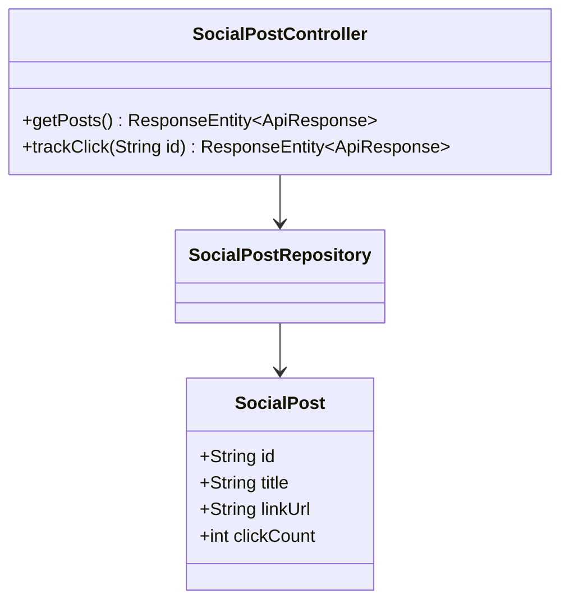
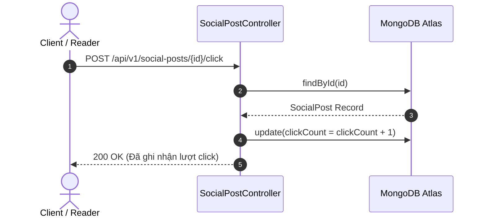

# UC-05.5 — Bài Đăng Mạng Xã Hội & Click Tracking (Social Posts & Click Tracking)

## 📋 1. Bảng Mô Tả Nghiệp Vụ (Business Description Table)

| Mục | Chi Tiết Nghiệp Vụ |
|---|---|
| **Mã Use Case** | `UC-05.5` |
| **Tên Tính Năng** | Danh sách bài đăng truyền cảm hứng & Đếm lượt click tương tác |
| **Actor Chính** | Guest / User |
| **Mục Tiêu** | Hiển thị tin tức truyền thông và ghi nhận lượt click người dùng vào link bài viết |
| **API Endpoint** | `GET /api/v1/social-posts`, `POST /api/v1/social-posts/{id}/click` |
| **Tiền Điều Kiện** | Bài đăng tồn tại trong hệ thống |
| **Hậu Điều Kiện** | Tăng `clickCount++` trong DB |
| **Quy Tắc Nghiệp Vụ** | Cho phép theo dõi hiệu quả truyền thông của bài viết |
| **Các Mã Lỗi Có Thể Gặp** | `POST_NOT_FOUND` (404) |

---

## 📐 2. Class Diagram

---

## 🔄 3. Sequence Diagram

---

## 🧪 4. Testing & Verification Report

- **Test Suite Class:** `com.mchub.services.impl.SocialPostServiceImplTest`
- **Method Kiểm Thử:** `trackClick_incrementsClickCount()`
- **Assertions:** `clickCount` tăng thêm 1 sau khi gọi API.
