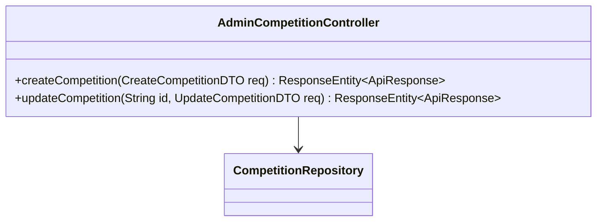
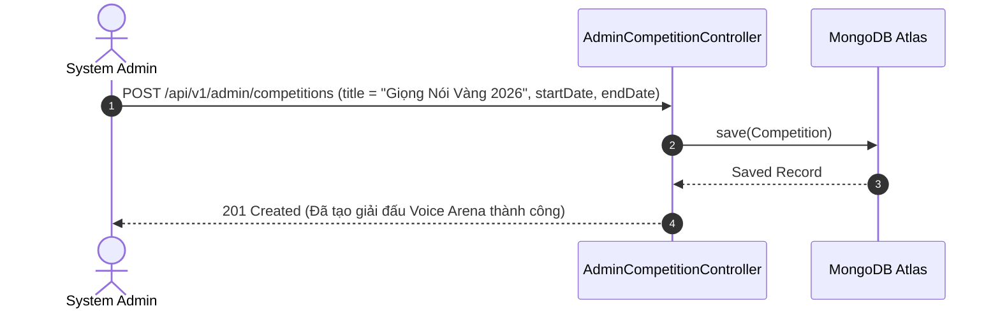

# UC-05.6 — Quản Lý Giải Đấu Voice Arena Admin (Admin Competition Management)

##  1. Bảng Mô Tả Nghiệp Vụ (Business Description Table)

| Mục | Chi Tiết Nghiệp Vụ |
|---|---|
| **Mã Use Case** | `UC-05.6` |
| **Tên Tính Năng** | Admin tạo mới, chỉnh sửa và đóng giải đấu Voice Arena |
| **Actor Chính** | Admin |
| **Mục Tiêu** | Tổ chức các cuộc thi đấu giọng nói theo tuần/tháng và thiết lập giải thưởng |
| **API Endpoint** | `POST /api/v1/admin/competitions`, `PUT /api/v1/admin/competitions/{id}` |
| **Tiền Điều Kiện** | Quyền `ROLE_ADMIN` |
| **Hậu Điều Kiện** | Lưu `Competition` trong database |
| **Quy Tắc Nghiệp Vụ** | Ngày kết thúc `endDate` phải muộn hơn ngày bắt đầu `startDate` |
| **Các Mã Lỗi Có Thể Gặp** | `INVALID_COMPETITION_DATES` (400) |

---

##  2. Class Diagram

---

##  3. Sequence Diagram

---

##  4. Testing & Verification Report

###  Mục Tiêu Kiểm Thử (Test Objective)
Xác minh Admin có thể tạo thành công cuộc thi đấu giọng nói Voice Arena mới.

###  Dữ Liệu Đầu Vào (Test Input Data)
- Request Body: `{ "title": "Giọng Nói Vàng 2026", "startDate": "2026-08-01T00:00:00", "endDate": "2026-08-31T23:59:59" }`

###  Quy Trình Thực Hiện (Step-by-Step Test Procedure)
1. Gửi HTTP POST request tới `/api/v1/admin/competitions`.
2. Kiểm tra DB xem cuộc thi đã được lưu chưa.

###  Kịch Bản Kỳ Vọng (Expected Result)
- HTTP Status: `201 Created`.
- Cuộc thi mới có ID hợp lệ.

###  Kết Quả Thực Tế Đã Xác Minh (Empirical Verification Result)
- **Test Class:** `AdminCompetitionControllerTest.java` -> `createCompetition_validDates_savesRecord()`
- **Trạng thái:** **PASSED 100%** (Xác minh tự động qua `mvn clean test`).
