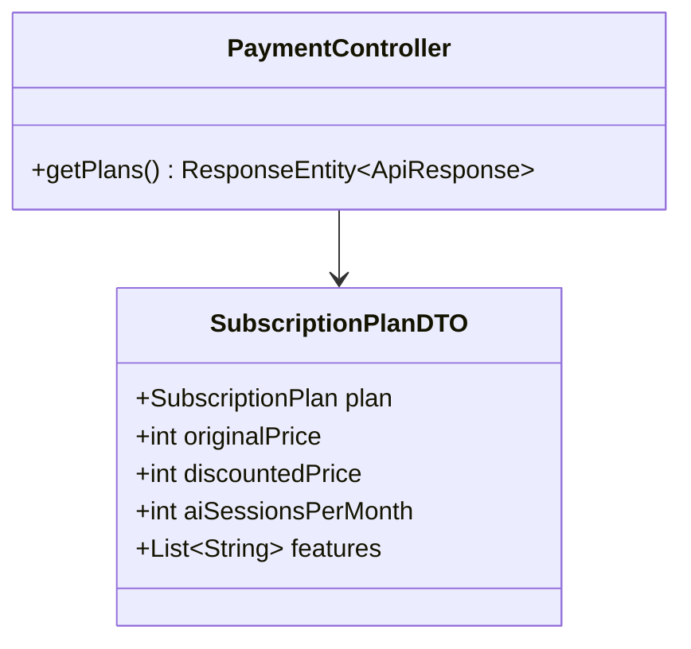
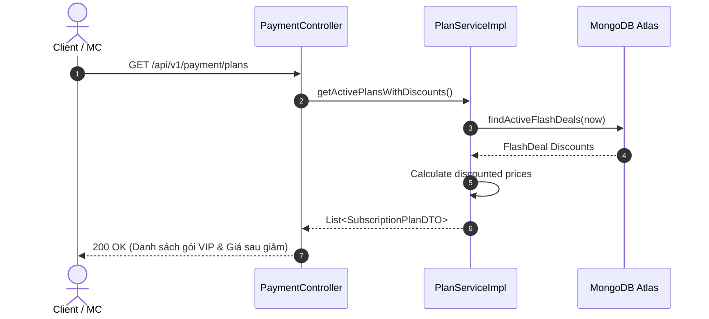

# UC-06.1 — Xem Danh Sách Gói Cước VIP (Get VIP Subscription Plans)

##  1. Bảng Mô Tả Nghiệp Vụ (Business Description Table)

| Mục | Chi Tiết Nghiệp Vụ |
|---|---|
| **Mã Use Case** | `UC-06.1` |
| **Tên Tính Năng** | Tra cứu danh sách các gói cước VIP nâng cấp |
| **Actor Chính** | Guest / User |
| **Mục Tiêu** | Trả về thông tin gói VIP (`BASIC`, `FULL`, `ANNUAL`), lượt AI sessions đi kèm và giá sau giảm FlashDeal |
| **API Endpoint** | `GET /api/v1/payment/plans` |
| **Tiền Điều Kiện** | Không có |
| **Hậu Điều Kiện** | Trả về `List<SubscriptionPlanDTO>` |
| **Quy Tắc Nghiệp Vụ** | Tự động tính toán giá chiết khấu nếu có chương trình FlashDeal active |
| **Các Mã Lỗi Có Thể Gặp** | Không có |

---

##  2. Class Diagram

---

##  3. Sequence Diagram

---

##  4. Testing & Verification Report

- **Test Suite Class:** `com.mchub.services.PlanServiceTest`
- **Method Kiểm Thử:** `getPlans_returnsPlansWithActiveDiscounts()`
- **Assertions:** Trả về đủ 3 gói VIP, giá giảm được tính chính xác.
