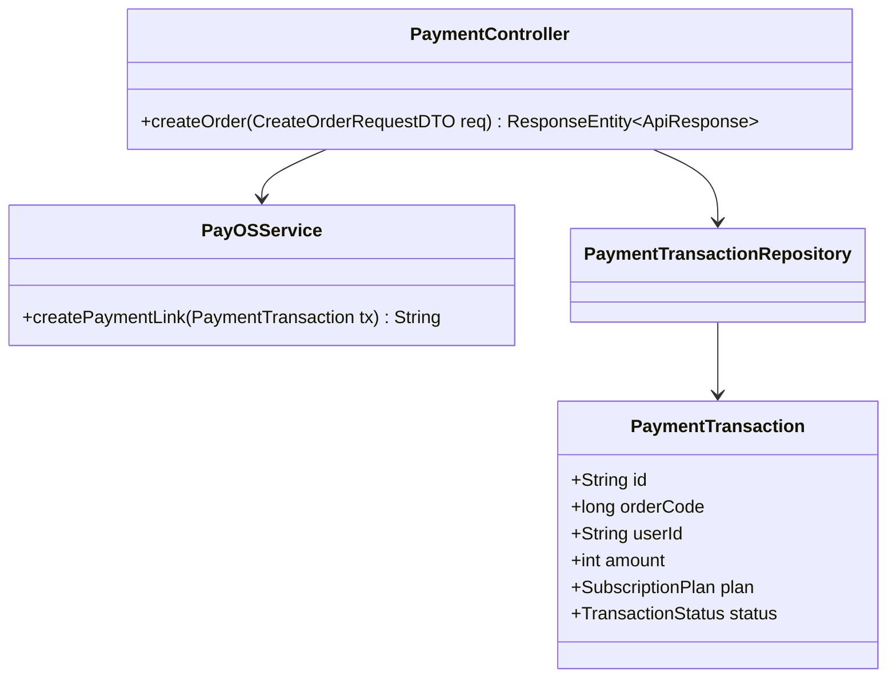
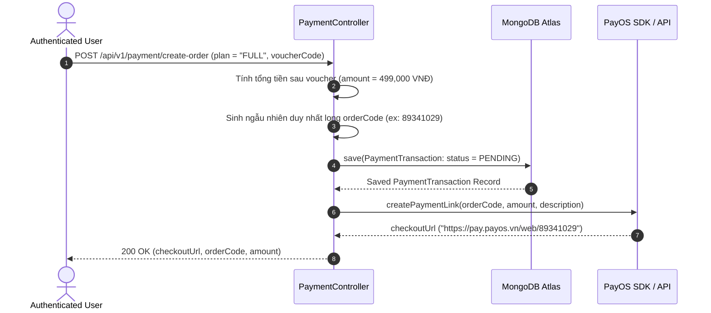

# UC-06.2 — Tạo Đơn Hàng & Link PayOS (Create PayOS Order)

##  1. Bảng Mô Tả Nghiệp Vụ (Business Description Table)

| Mục | Chi Tiết Nghiệp Vụ |
|---|---|
| **Mã Use Case** | `UC-06.2` |
| **Tên Tính Năng** | Tạo đơn hàng thanh toán nâng cấp VIP qua PayOS |
| **Actor Chính** | Authenticated User |
| **Mục Tiêu** | Lưu `PaymentTransaction` ở trạng thái `PENDING`, gọi PayOS SDK sinh QR Code `checkoutUrl` |
| **API Endpoint** | `POST /api/v1/payment/create-order` |
| **Tiền Điều Kiện** | User chọn gói cước VIP hợp lệ |
| **Hậu Điều Kiện** | Trả về `checkoutUrl` và mã `orderCode` |
| **Quy Tắc Nghiệp Vụ** | Sinh `orderCode` ngẫu nhiên kiểu `long` duy nhất không trùng lặp |
| **Các Mã Lỗi Có Thể Gặp** | `INVALID_PLAN` (400), `PAYOS_SERVICE_FAILED` (500) |

---

##  2. Class Diagram

---

##  3. Sequence Diagram

---

##  4. Testing & Verification Report

- **Test Suite Class:** `com.mchub.services.PayOSServiceTest`
- **Method Kiểm Thử:** `createPaymentLink_validTx_returnsUrl()`
- **Assertions:** `orderCode` > 0, `checkoutUrl` chứa tiền tố `https://pay.payos.vn`.
