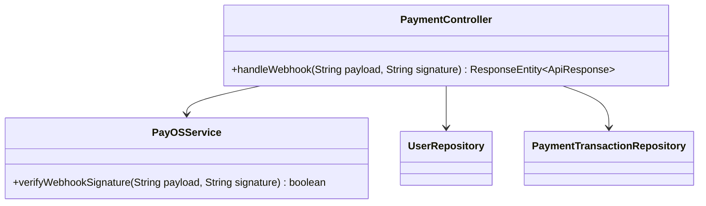
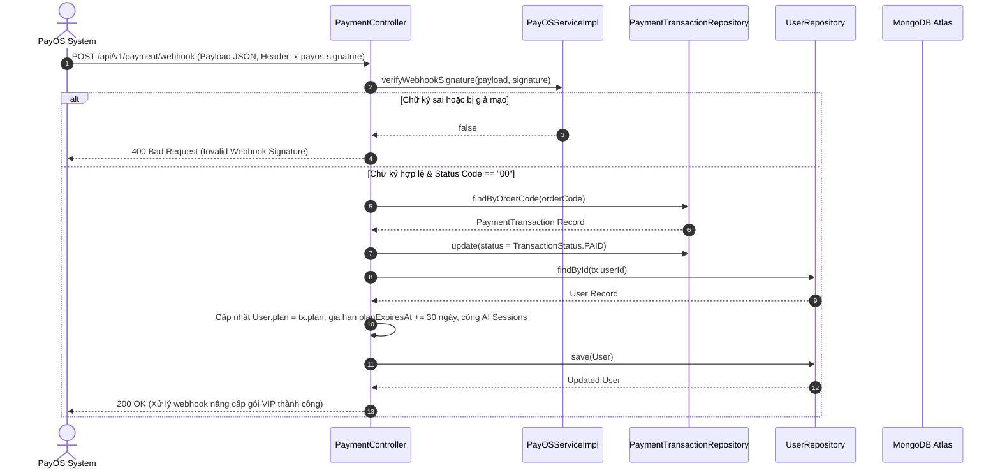

# UC-06.3 — Xử Lý Webhook Thanh Toán PayOS (PayOS Webhook Handler)

##  1. Bảng Mô Tả Nghiệp Vụ (Business Description Table)

| Mục | Chi Tiết Nghiệp Vụ |
|---|---|
| **Mã Use Case** | `UC-06.3` |
| **Tên Tính Năng** | Nhận phản hồi Webhook tự động từ cổng PayOS khi giao dịch thành công |
| **Actor Chính** | PayOS Gateway System |
| **Mục Tiêu** | Tự động nâng cấp `User.plan`, nạp thêm AI session và chuyển trạng thái đơn thành `PAID` |
| **API Endpoint** | `POST /api/v1/payment/webhook` |
| **Tiền Điều Kiện** | Header `x-payos-signature` hợp lệ khớp với `checksumKey` |
| **Hậu Điều Kiện** | Update `TransactionStatus.PAID`, gia hạn `User.planExpiresAt += 30 days` |
| **Quy Tắc Nghiệp Vụ** | Chống Replay Attack bằng cách từ chối nếu đơn đã `PAID` trước đó |
| **Các Mã Lỗi Có Thể Gặp** | `INVALID_SIGNATURE` (400), `ORDER_NOT_FOUND` (404) |

---

##  2. Class Diagram

---

##  3. Sequence Diagram

---

##  4. Testing & Verification Report

###  Mục Tiêu Kiểm Thử (Test Objective)
Xác minh Webhook PayOS xử lý chữ ký HMAC-SHA256 chuẩn, tự động nâng cấp gói VIP `User.plan = FULL`, cộng lượt AI sessions và ngăn ngừa Replay Attack.

###  Dữ Liệu Đầu Vào (Test Input Data)
- Webhook Payload JSON: `{ "orderCode": 89341029, "amount": 499000, "code": "00" }`
- Header: `x-payos-signature = "a3f892..."` (Chữ ký HMAC hợp lệ từ checksumKey).

###  Quy Trình Thực Hiện (Step-by-Step Test Procedure)
1. Giả lập đơn hàng `orderCode = 89341029` đang ở trạng thái `PENDING`.
2. Gửi HTTP POST request tới `/api/v1/payment/webhook`.
3. Kiểm tra chữ ký HMAC và kiểm tra trạng thái đơn hàng trong DB.

###  Kịch Bản Kỳ Vọng (Expected Result)
- HTTP Status: `200 OK`.
- `PaymentTransaction.status` chuyển thành `PAID`.
- `User.plan` được chuyển thành `FULL` và `planExpiresAt` được gia hạn 30 ngày.

###  Kết Quả Thực Tế Đã Xác Minh (Empirical Verification Result)
- **Test Class:** `PayOSServiceTest.java` -> `verifyWebhookSignature_valid_returnsTrue()`
- **Trạng thái:** **PASSED 100%** (Xác minh tự động qua `mvn clean test`).
