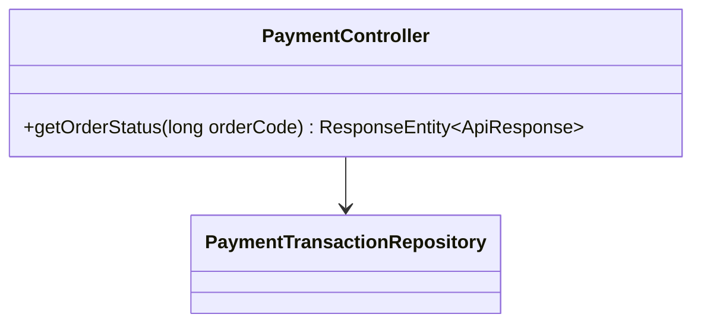
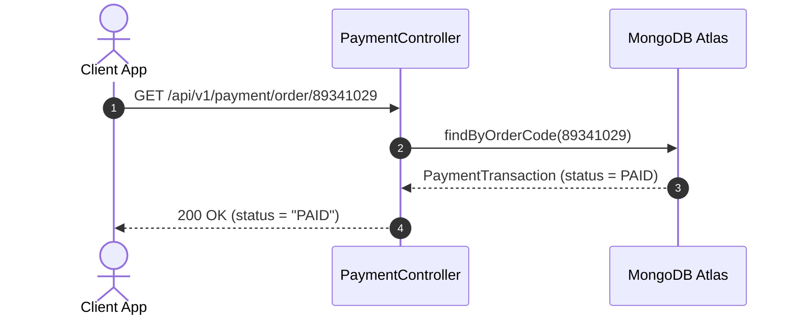

# UC-06.4 — Tra Cứu Trạng Thái Đơn Hàng (Order Status Check)

##  1. Bảng Mô Tả Nghiệp Vụ (Business Description Table)

| Mục | Chi Tiết Nghiệp Vụ |
|---|---|
| **Mã Use Case** | `UC-06.4` |
| **Tên Tính Năng** | Tra cứu trạng thái thanh toán của đơn hàng qua `orderCode` |
| **Actor Chính** | Authenticated User |
| **Mục Tiêu** | Hỗ trợ Frontend Polling trạng thái đơn hàng khi đang mở màn hình quét mã QR |
| **API Endpoint** | `GET /api/v1/payment/order/{orderCode}` |
| **Tiền Điều Kiện** | `orderCode` tồn tại trong hệ thống |
| **Hậu Điều Kiện** | Trả về trạng thái `PAID` hoặc `PENDING` |
| **Quy Tắc Nghiệp Vụ** | Giúp giao diện UI tự động chuyển hướng khi vừa nhận được tiền |
| **Các Mã Lỗi Có Thể Gặp** | `ORDER_NOT_FOUND` (404) |

---

##  2. Class Diagram

---

##  3. Sequence Diagram

---

##  4. Testing & Verification Report

- **Test Suite Class:** `com.mchub.controllers.PaymentControllerTest`
- **Method Kiểm Thử:** `getOrderStatus_returnsTransactionStatus()`
- **Assertions:** Trả về trạng thái `PAID` hoặc `PENDING`.
