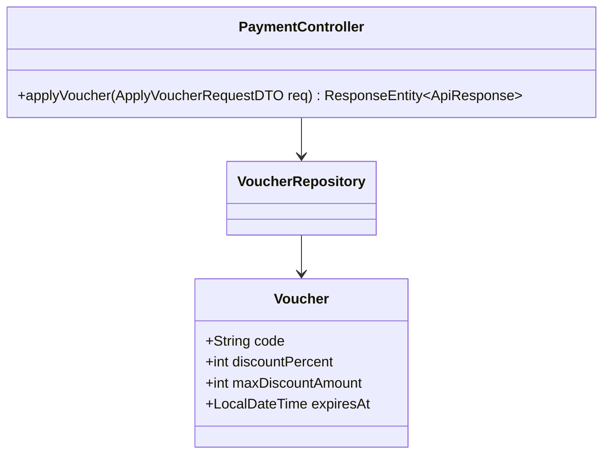
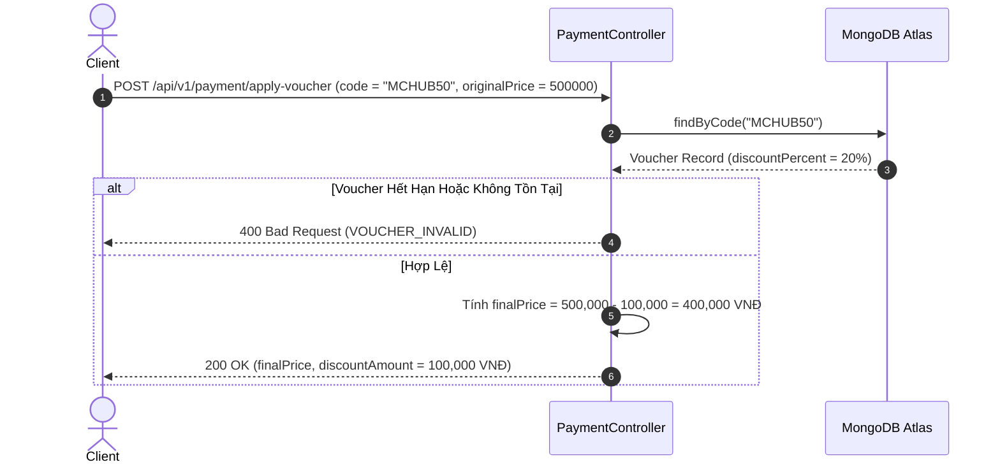

# UC-06.5 — Áp Dụng Mã Giảm Giá Voucher (Apply Discount Voucher)

## 📋 1. Bảng Mô Tả Nghiệp Vụ (Business Description Table)

| Mục | Chi Tiết Nghiệp Vụ |
|---|---|
| **Mã Use Case** | `UC-06.5` |
| **Tên Tính Năng** | Kiểm tra và Áp dụng mã giảm giá voucher vào đơn hàng |
| **Actor Chính** | Authenticated User |
| **Mục Tiêu** | Tính toán số tiền được chiết khấu trước khi bấm tạo link thanh toán PayOS |
| **API Endpoint** | `POST /api/v1/payment/apply-voucher` |
| **Tiền Điều Kiện** | Mã voucher hợp lệ và chưa vượt quá `maxUsageCount` hay `expiresAt` |
| **Hậu Điều Kiện** | Trả về tổng tiền giảm và giá cuối cùng phải trả (`finalPrice`) |
| **Quy Tắc Nghiệp Vụ** | Số tiền giảm = `min(originalPrice * discountPercent, maxDiscountAmount)` |
| **Các Mã Lỗi Có Thể Gặp** | `VOUCHER_INVALID` (400), `VOUCHER_EXPIRED` (400) |

---

## 📐 2. Class Diagram

---

## 🔄 3. Sequence Diagram

---

## 🧪 4. Testing & Verification Report

- **Test Suite Class:** `com.mchub.services.PlanServiceTest`
- **Method Kiểm Thử:** `applyDiscount_validCode_calculatesDiscount()`
- **Assertions:** Số tiền giảm không vượt quá `maxDiscountAmount`.
