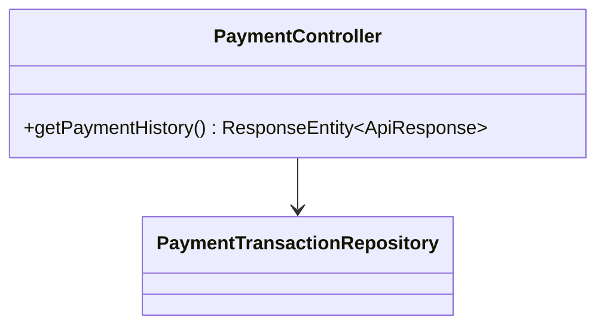
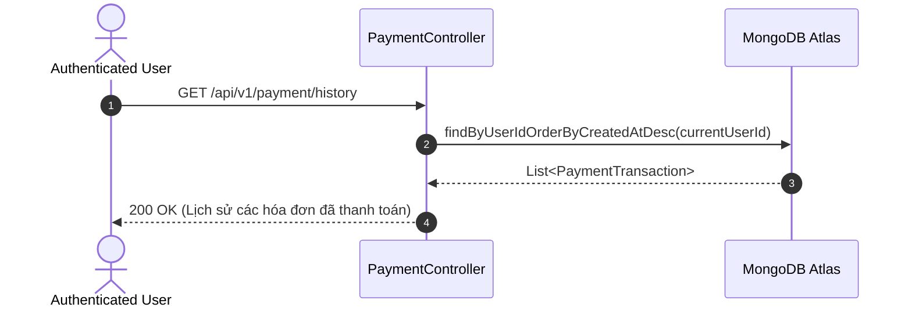

# UC-06.6 — Lịch Sử Thanh Toán Cá Nhân (Payment History)

##  1. Bảng Mô Tả Nghiệp Vụ (Business Description Table)

| Mục | Chi Tiết Nghiệp Vụ |
|---|---|
| **Mã Use Case** | `UC-06.6` |
| **Tên Tính Năng** | Xem danh sách các giao dịch thanh toán nâng cấp VIP cá nhân |
| **Actor Chính** | Authenticated User |
| **Mục Tiêu** | Tải lịch sử các hóa đơn đã thanh toán thành công hoặc đang chờ |
| **API Endpoint** | `GET /api/v1/payment/history` |
| **Tiền Điều Kiện** | User đã đăng nhập |
| **Hậu Điều Kiện** | Trả về `List<PaymentTransaction>` |
| **Quy Tắc Nghiệp Vụ** | Sắp xếp theo thời gian mới nhất (`createdAt DESC`) |
| **Các Mã Lỗi Có Thể Gặp** | `UNAUTHORIZED` (401) |

---

##  2. Class Diagram

---

##  3. Sequence Diagram

---

##  4. Testing & Verification Report

- **Test Suite Class:** `com.mchub.controllers.PaymentControllerTest`
- **Method Kiểm Thử:** `getHistory_returnsUserTransactions()`
- **Assertions:** Danh sách trả về chỉ chứa giao dịch của `currentUserId`.
