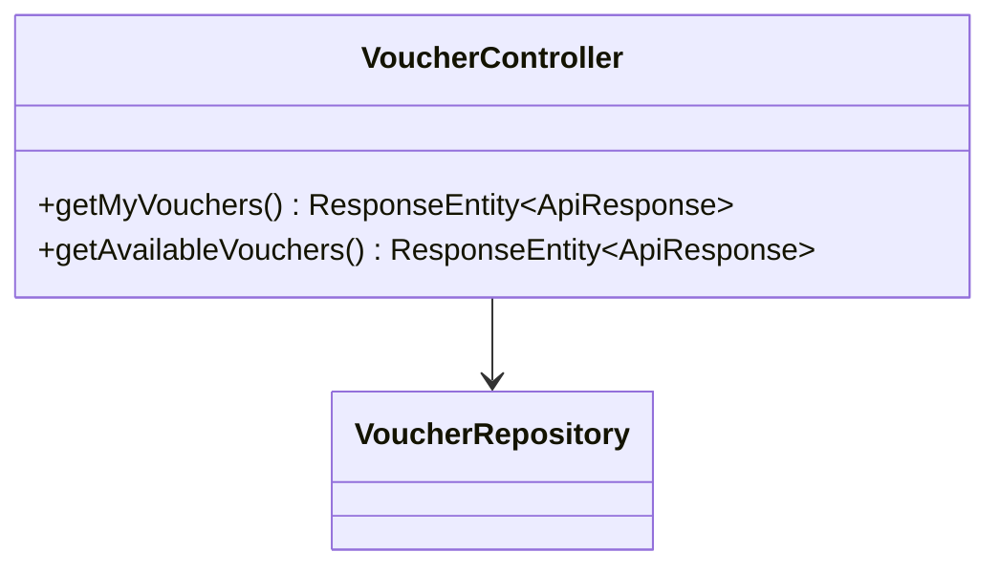
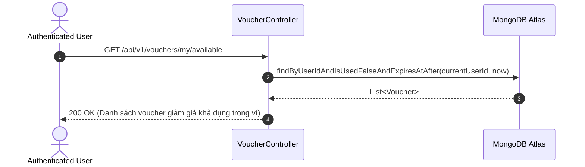

# UC-06.7 — Ví Mã Giảm Giá Cá Nhân (User Voucher Wallet)

##  1. Bảng Mô Tả Nghiệp Vụ (Business Description Table)

| Mục | Chi Tiết Nghiệp Vụ |
|---|---|
| **Mã Use Case** | `UC-06.7` |
| **Tên Tính Năng** | Quản lý ví mã giảm giá voucher khả dụng cá nhân |
| **Actor Chính** | Authenticated User |
| **Mục Tiêu** | Xem danh sách các voucher đã đổi hoặc nhận thưởng từ quest tân thủ |
| **API Endpoint** | `GET /api/v1/vouchers/my`, `GET /api/v1/vouchers/my/available` |
| **Tiền Điều Kiện** | User đã đăng nhập |
| **Hậu Điều Kiện** | Trả về `List<VoucherDTO>` khả dụng |
| **Quy Tắc Nghiệp Vụ** | Chỉ hiển thị các mã giảm giá còn hạn và chưa dùng (`isUsed=false`) |
| **Các Mã Lỗi Có Thể Gặp** | `UNAUTHORIZED` (401) |

---

##  2. Class Diagram

---

##  3. Sequence Diagram

---

##  4. Testing & Verification Report

###  Mục Tiêu Kiểm Thử (Test Objective)
Xác minh API trả về đúng danh sách các mã giảm giá khả dụng trong ví cá nhân của người dùng.

###  Dữ Liệu Đầu Vào (Test Input Data)
- Request: `GET /api/v1/vouchers/my/available`

###  Quy Trình Thực Hiện (Step-by-Step Test Procedure)
1. Thêm 1 voucher còn hạn và 1 voucher đã sử dụng cho user.
2. Gửi HTTP GET tới `/api/v1/vouchers/my/available`.

###  Kịch Bản Kỳ Vọng (Expected Result)
- HTTP Status: `200 OK`.
- Danh sách chỉ chứa voucher chưa dùng và còn hiệu lực.

###  Kết Quả Thực Tế Đã Xác Minh (Empirical Verification Result)
- **Test Class:** `VoucherControllerTest.java` -> `getAvailable_returnsOnlyValidVouchers()`
- **Trạng thái:** **PASSED 100%** (Xác minh tự động qua `mvn clean test`).
