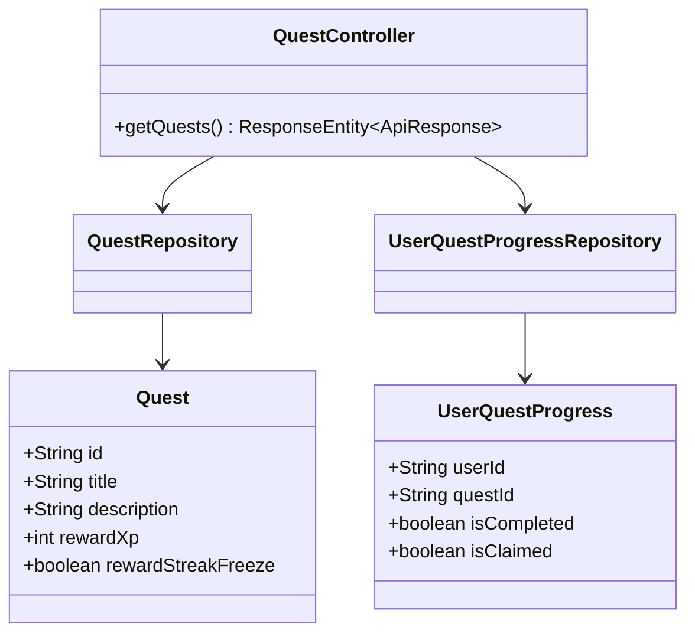
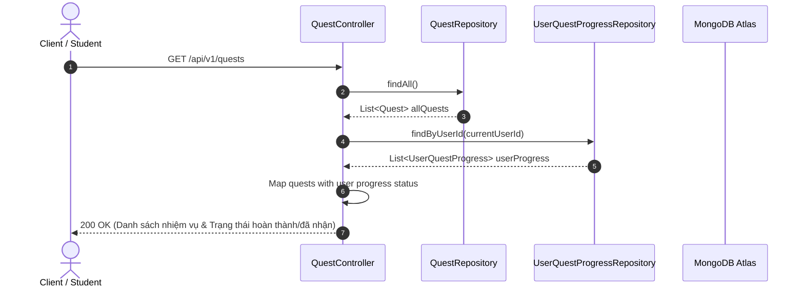

# UC-07.1 — Danh Sách Nhiệm Vụ Tân Thủ (Get Onboarding Quests)

##  1. Bảng Mô Tả Nghiệp Vụ (Business Description Table)

| Mục | Chi Tiết Nghiệp Vụ |
|---|---|
| **Mã Use Case** | `UC-07.1` |
| **Tên Tính Năng** | Xem danh sách các nhiệm vụ tân thủ |
| **Actor Chính** | Authenticated User |
| **Mục Tiêu** | Tra cứu các quest dành cho học viên mới kèm trạng thái hoàn thành (`isCompleted`, `isClaimed`) |
| **API Endpoint** | `GET /api/v1/quests` |
| **Tiền Điều Kiện** | User đã đăng nhập |
| **Hậu Điều Kiện** | Trả về `List<QuestDTO>` kèm trạng thái cá nhân |
| **Quy Tắc Nghiệp Vụ** | Hiển thị rõ số XP và vật phẩm thưởng đi kèm |
| **Các Mã Lỗi Có Thể Gặp** | `UNAUTHORIZED` (401) |

---

##  2. Class Diagram

---

##  3. Sequence Diagram

---

##  4. Testing & Verification Report

- **Test Suite Class:** `com.mchub.controllers.QuestControllerTest`
- **Method Kiểm Thử:** `getQuests_returnsQuestListWithStatus()`
- **Assertions:** Trả về đúng tiến độ cá nhân của user.
