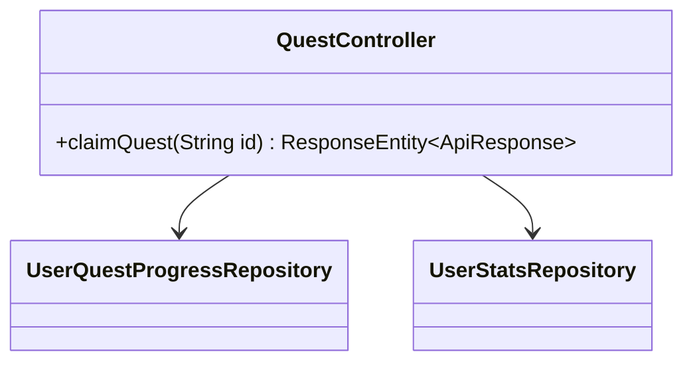
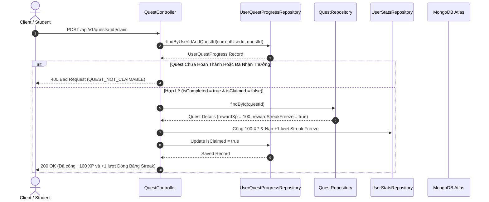

# UC-07.2 — Nhận Phần Thưởng Quest Tân Thủ (Claim Quest Reward)

## 📋 1. Bảng Mô Tả Nghiệp Vụ (Business Description Table)

| Mục | Chi Tiết Nghiệp Vụ |
|---|---|
| **Mã Use Case** | `UC-07.2` |
| **Tên Tính Năng** | Nhận phần thưởng nhiệm vụ tân thủ (Claim Quest) |
| **Actor Chính** | Authenticated User |
| **Mục Tiêu** | Cộng thưởng XP và Streak Freeze cho nhiệm vụ đã hoàn thành |
| **API Endpoint** | `POST /api/v1/quests/{id}/claim` |
| **Tiền Điều Kiện** | `UserQuestProgress.isCompleted = true` và `isClaimed = false` |
| **Hậu Điều Kiện** | Cộng XP / Freeze vào `UserStats` và set `isClaimed = true` |
| **Quy Tắc Nghiệp Vụ** | Mỗi nhiệm vụ chỉ được nhận thưởng đúng 1 lần duy nhất |
| **Các Mã Lỗi Có Thể Gặp** | `QUEST_NOT_CLAIMABLE` (400), `QUEST_ALREADY_CLAIMED` (400) |

---

## 📐 2. Class Diagram

---

## 🔄 3. Sequence Diagram

---

## 🧪 4. Testing & Verification Report

- **Test Suite Class:** `com.mchub.controllers.QuestControllerTest`
- **Method Kiểm Thử:** `claimQuest_validCompletedQuest_grantsReward()`
- **Assertions:** `isClaimed == true`, User XP tăng đúng số lượng.
