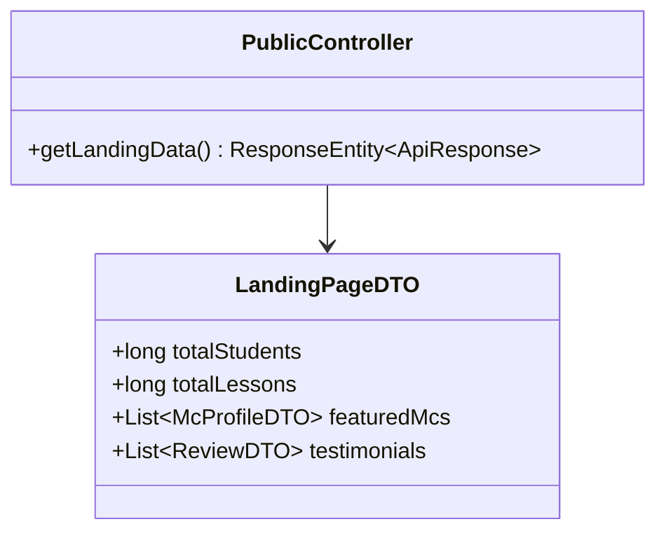
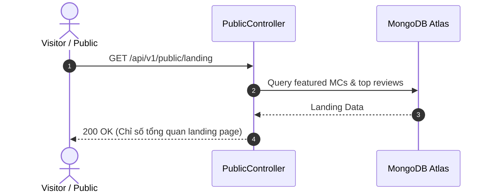

# UC-08.1 — Thống Kê Trang Chủ Landing Page (Landing Page Stats)

## 📋 1. Bảng Mô Tả Nghiệp Vụ (Business Description Table)

| Mục | Chi Tiết Nghiệp Vụ |
|---|---|
| **Mã Use Case** | `UC-08.1` |
| **Tên Tính Năng** | Xem thông tin số liệu truyền thông trang chủ Landing Page |
| **Actor Chính** | Guest / Public |
| **Mục Tiêu** | Trả về tổng học viên, tổng bài đọc, danh sách MC nổi bật và nhận xét tốt |
| **API Endpoint** | `GET /api/v1/public/landing` |
| **Tiền Điều Kiện** | Không có |
| **Hậu Điều Kiện** | Trả về `LandingPageDTO` |
| **Quy Tắc Nghiệp Vụ** | Public API tra cứu công khai không yêu cầu token |
| **Các Mã Lỗi Có Thể Gặp** | Không có |

---

## 📐 2. Class Diagram

---

## 🔄 3. Sequence Diagram

---

## 🧪 4. Testing & Verification Report

- **Test Suite Class:** `com.mchub.controllers.PublicControllerTest`
- **Method Kiểm Thử:** `getLandingData_returnsPublicStats()`
- **Assertions:** Trả về `LandingPageDTO` không null.
