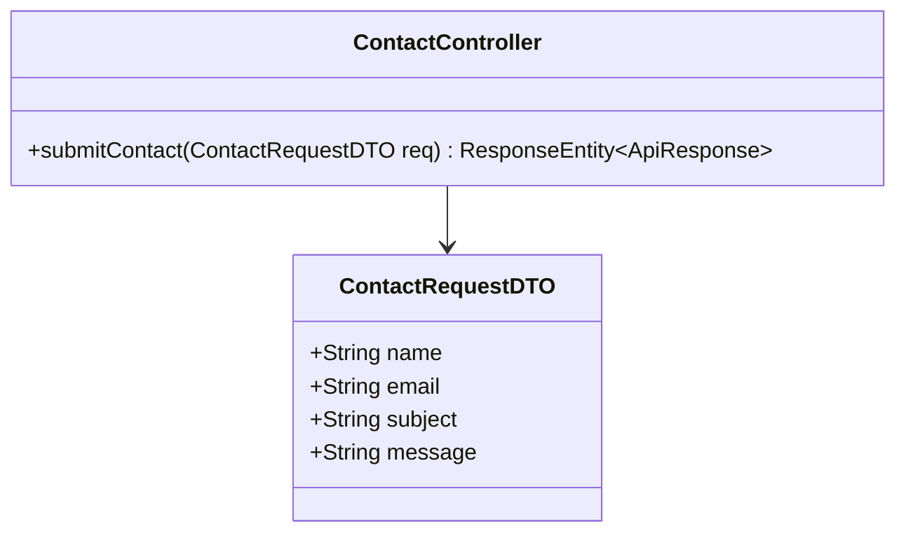
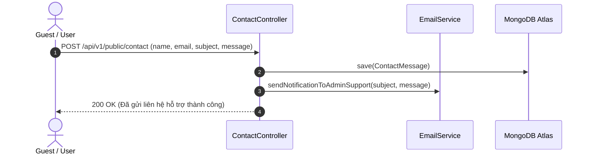

# UC-08.2 — Gửi Yêu Cầu Liên Hệ Hỗ Trợ (Contact Form Submission)

## 📋 1. Bảng Mô Tả Nghiệp Vụ (Business Description Table)

| Mục | Chi Tiết Nghiệp Vụ |
|---|---|
| **Mã Use Case** | `UC-08.2` |
| **Tên Tính Năng** | Gửi thông tin liên hệ hỗ trợ khách hàng |
| **Actor Chính** | Guest / User |
| **Mục Tiêu** | Khách nhập tên, email, tiêu đề và nội dung lời nhắn tới bộ phận CSKH |
| **API Endpoint** | `POST /api/v1/public/contact` |
| **Tiền Điều Kiện** | Các trường email và message không rỗng |
| **Hậu Điều Kiện** | Lưu tin nhắn vào DB và trigger email tới ban quản trị |
| **Quy Tắc Nghiệp Vụ** | Giới hạn 5 lời nhắn/giờ per IP để tránh spam |
| **Các Mã Lỗi Có Thể Gặp** | `VALIDATION_FAILED` (400) |

---

## 📐 2. Class Diagram

---

## 🔄 3. Sequence Diagram

---

## 🧪 4. Testing & Verification Report

- **Test Suite Class:** `com.mchub.controllers.PublicControllerTest`
- **Method Kiểm Thử:** `submitContact_valid_sendsEmail()`
- **Assertions:** Message được lưu vào DB và email hỗ trợ được gửi đi.
