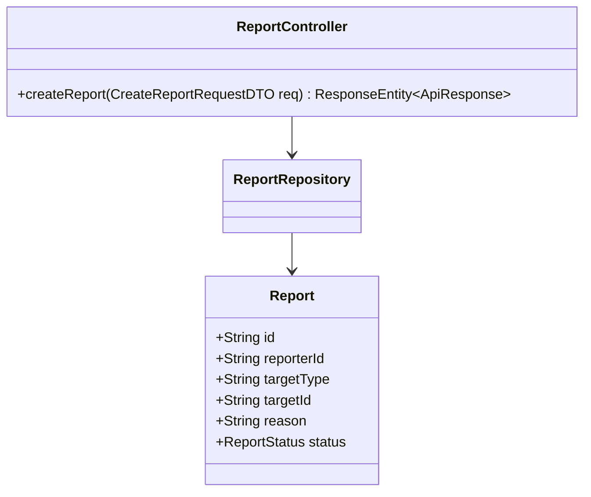
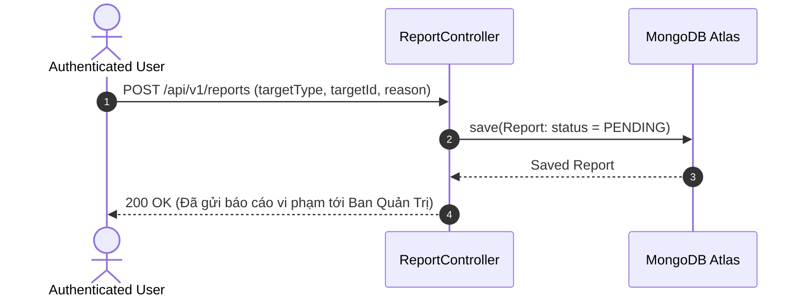

# UC-08.3 — Gửi Báo Cáo Nội Dung Vi Phạm (Submit Content Report)

##  1. Bảng Mô Tả Nghiệp Vụ (Business Description Table)

| Mục | Chi Tiết Nghiệp Vụ |
|---|---|
| **Mã Use Case** | `UC-08.3` |
| **Tên Tính Năng** | Báo cáo nội dung hoặc tài khoản vi phạm |
| **Actor Chính** | Authenticated User |
| **Mục Tiêu** | Gửi báo cáo vi phạm (`targetType`, `targetId`, `reason`) tới Admin |
| **API Endpoint** | `POST /api/v1/reports` |
| **Tiền Điều Kiện** | User đã đăng nhập |
| **Hậu Điều Kiện** | Tạo bản ghi `Report` ở trạng thái `PENDING` |
| **Quy Tắc Nghiệp Vụ** | Lý do không được rỗng. `targetType` thuộc: `POST`, `REVIEW`, `USER` |
| **Các Mã Lỗi Có Thể Gặp** | `VALIDATION_FAILED` (400), `UNAUTHORIZED` (401) |

---

##  2. Class Diagram

---

##  3. Sequence Diagram

---

##  4. Testing & Verification Report

- **Test Suite Class:** `com.mchub.controllers.ReportControllerTest`
- **Method Kiểm Thử:** `createReport_success_createsPendingReport()`
- **Assertions:** Bản ghi `Report` có trạng thái `PENDING`.
