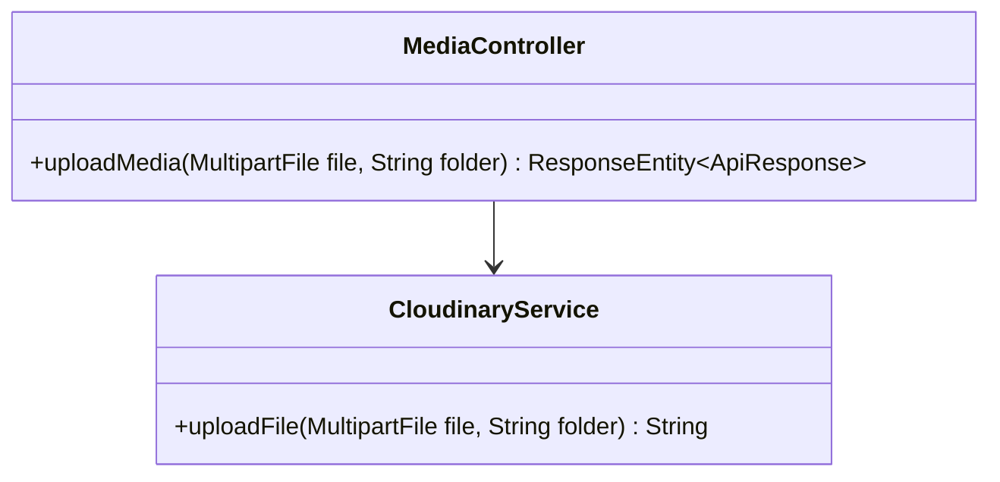
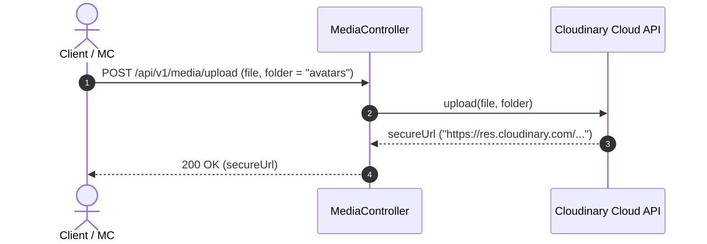

# UC-08.4 — Tải Lên Tệp Đa Phương Tiện Cloudinary (Cloudinary Upload)

## 📋 1. Bảng Mô Tả Nghiệp Vụ (Business Description Table)

| Mục | Chi Tiết Nghiệp Vụ |
|---|---|
| **Mã Use Case** | `UC-08.4` |
| **Tên Tính Năng** | Upload tệp đa phương tiện (Ảnh / Ghi âm) lên Cloudinary CDN |
| **Actor Chính** | Authenticated User |
| **Mục Tiêu** | Đẩy tệp phương tiện lên Cloudinary storage và nhận HTTPS secure URL |
| **API Endpoint** | `POST /api/v1/media/upload` |
| **Tiền Điều Kiện** | File hình ảnh < 5MB hoặc Audio < 20MB |
| **Hậu Điều Kiện** | Trả về HTTPS Cloudinary URL |
| **Quy Tắc Nghiệp Vụ** | Phân chia lưu trữ theo các thư mục `avatars`, `audio_practice`, `certificates` |
| **Các Mã Lỗi Có Thể Gặp** | `INVALID_FILE_TYPE` (400), `FILE_TOO_LARGE` (400) |

---

## 📐 2. Class Diagram

---

## 🔄 3. Sequence Diagram

---

## 🧪 4. Testing & Verification Report

- **Test Suite Class:** `com.mchub.controllers.MediaControllerTest`
- **Method Kiểm Thử:** `upload_validFile_returnsUrl()`
- **Assertions:** Trả về HTTPS URL Cloudinary hợp lệ.
