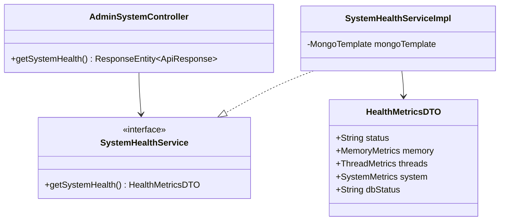
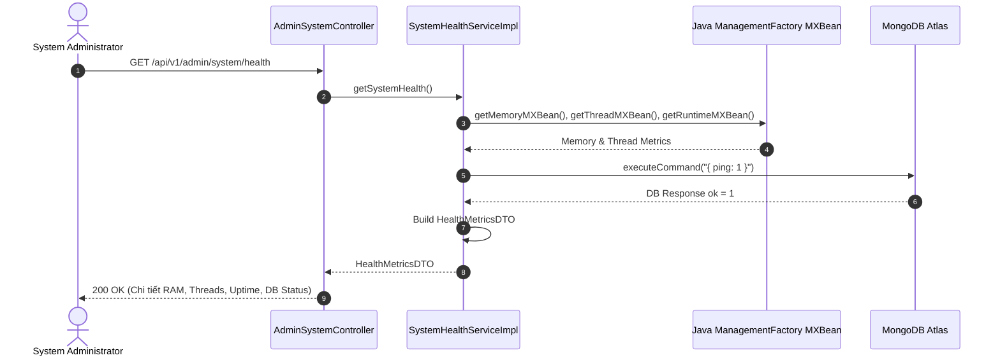

# UC-09.1 — Giám Sát Sức Khỏe Hệ Thống Realtime (System Health Monitoring)

## 📋 1. Bảng Mô Tả Nghiệp Vụ (Business Description Table)

| Mục | Chi Tiết Nghiệp Vụ |
|---|---|
| **Mã Use Case** | `UC-09.1` |
| **Tên Tính Năng** | Giám sát sức khỏe và hiệu năng hệ thống realtime |
| **Actor Chính** | Admin (Quản trị viên) |
| **Mục Tiêu** | Đo đạc các chỉ số RAM Heap/Non-heap, Active Virtual Threads, Peak Threads, Server Uptime và MongoDB Ping Status |
| **API Endpoint** | `GET /api/v1/admin/system/health` |
| **Tiền Điều Kiện** | Yêu cầu quyền `ROLE_ADMIN` |
| **Hậu Điều Kiện** | Trả về `HealthMetricsDTO` |
| **Quy Tắc Nghiệp Vụ** | Thực thi lệnh `ping` MongoDB trực tiếp để đo latency DB realtime |
| **Các Mã Lỗi Có Thể Gặp** | `FORBIDDEN` (403), `UNAUTHORIZED` (401) |

---

## 📐 2. Class Diagram

---

## 🔄 3. Sequence Diagram

---

## 🧪 4. Testing & Verification Report

- **Test Suite Class:** `com.mchub.services.impl.SystemHealthServiceImplTest`
- **Method Kiểm Thử:** `getSystemHealth_returnsValidMetrics()`
- **Assertions:** RAM Heap MB > 0, `dbStatus` bằng `"UP"`.
