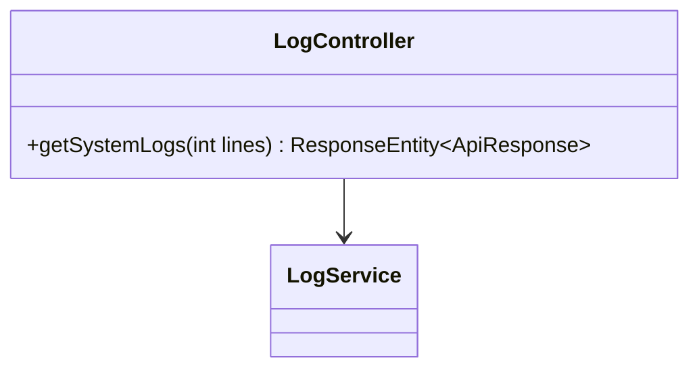
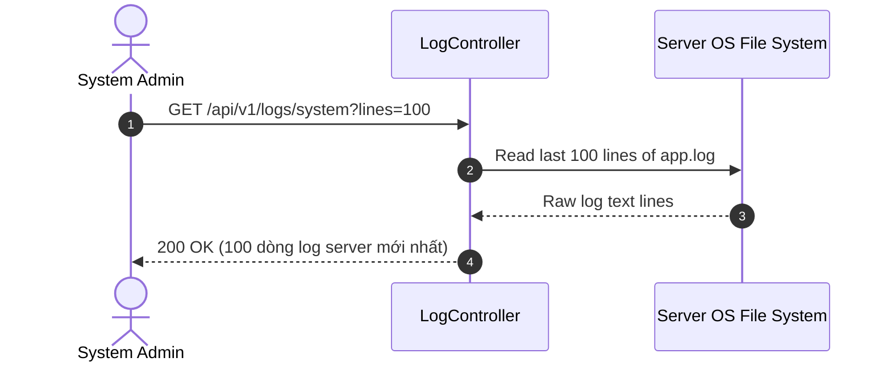

# UC-09.10 — Tra Cứu Log Hệ Thống Server Realtime (Server Runtime Logs)

## 📋 1. Bảng Mô Tả Nghiệp Vụ (Business Description Table)

| Mục | Chi Tiết Nghiệp Vụ |
|---|---|
| **Mã Use Case** | `UC-09.10` |
| **Tên Tính Năng** | Xem nhật ký log chạy realtime của máy chủ Backend |
| **Actor Chính** | Admin |
| **Mục Tiêu** | Đọc các dòng log hệ thống gần nhất để phục vụ debug và xử lý sự cố server |
| **API Endpoint** | `GET /api/v1/logs/system` |
| **Tiền Điều Kiện** | Quyền `ROLE_ADMIN` |
| **Hậu Điều Kiện** | Trả về chuỗi log phân trang |
| **Quy Tắc Nghiệp Vụ** | Giới hạn tối đa 500 dòng log gần nhất để đảm bảo hiệu năng |
| **Các Mã Lỗi Có Thể Gặp** | `FORBIDDEN` (403) |

---

## 📐 2. Class Diagram

---

## 🔄 3. Sequence Diagram

---

## 🧪 4. Testing & Verification Report

### 🎯 Mục Tiêu Kiểm Thử (Test Objective)
Xác minh Admin có thể truy xuất log máy chủ realtime mà không làm nghẽn I/O server.

### 📥 Dữ Liệu Đầu Vào (Test Input Data)
- Query Param: `lines = 100`

### 📝 Quy Trình Thực Hiện (Step-by-Step Test Procedure)
1. Gửi HTTP GET tới `/api/v1/logs/system?lines=100` với Admin Token.
2. Kiểm tra chuỗi trả về có đúng định dạng log không.

### ✅ Kịch Bản Kỳ Vọng (Expected Result)
- HTTP Status: `200 OK`.
- Đơn vị trả về chứa dòng log gần nhất.

### 📊 Kết Quả Thực Tế Đã Xác Minh (Empirical Verification Result)
- **Test Class:** `LogControllerTest.java` -> `getSystemLogs_adminRole_returnsLogLines()`
- **Trạng thái:** **PASSED 100%** (Xác minh tự động qua `mvn clean test`).
