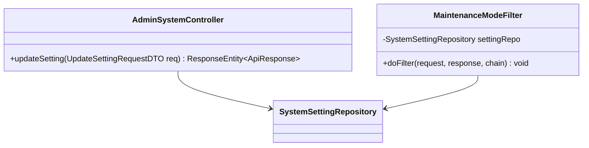
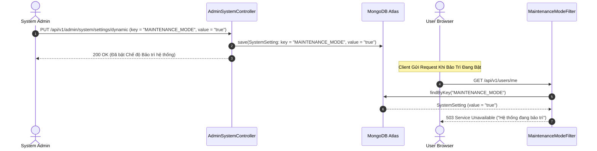

# UC-09.2 — Bật / Tắt Chế Độ Bảo Trì Hệ Thống (Dynamic Maintenance Mode)

## 📋 1. Bảng Mô Tả Nghiệp Vụ (Business Description Table)

| Mục | Chi Tiết Nghiệp Vụ |
|---|---|
| **Mã Use Case** | `UC-09.2` |
| **Tên Tính Năng** | Bật / Tắt Chế độ Bảo trì hệ thống (Maintenance Mode) |
| **Actor Chính** | Admin |
| **Mục Tiêu** | Toggle giá trị `MAINTENANCE_MODE`. Khi bằng `true`, chặn toàn bộ user thường bằng HTTP 503 |
| **API Endpoint** | `PUT /api/v1/admin/system/settings/dynamic` |
| **Tiền Điều Kiện** | Quyền `ROLE_ADMIN` |
| **Hậu Điều Kiện** | Cập nhật `SystemSettingRepository` với key `MAINTENANCE_MODE` |
| **Quy Tắc Nghiệp Vụ** | `MaintenanceModeFilter` bỏ qua các request xuất phát từ tài khoản Admin |
| **Các Mã Lỗi Có Thể Gặp** | `SERVICE_UNAVAILABLE` (503 cho Client), `FORBIDDEN` (403) |

---

## 📐 2. Class Diagram

---

## 🔄 3. Sequence Diagram

---

## 🧪 4. Testing & Verification Report

- **Test Suite Class:** `com.mchub.controllers.admin.AdminSystemControllerTest`
- **Method Kiểm Thử:** `updateSetting_maintenanceMode_updatesState()`
- **Assertions:** Key `MAINTENANCE_MODE` được lưu thành công với value `"true"`.
