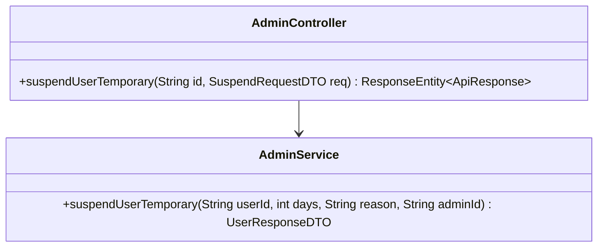
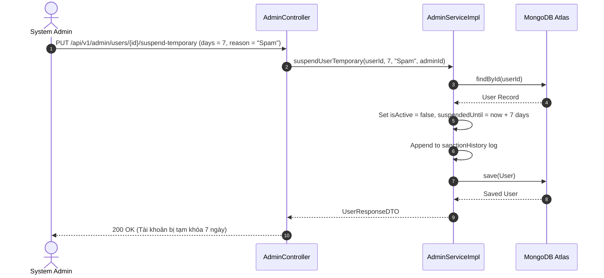

# UC-09.3 — Tạm Khóa Tài Khoản Người Dùng Có Thời Hạn (Temporary Sanction)

## 📋 1. Bảng Mô Tả Nghiệp Vụ (Business Description Table)

| Mục | Chi Tiết Nghiệp Vụ |
|---|---|
| **Mã Use Case** | `UC-09.3` |
| **Tên Tính Năng** | Tạm khóa tài khoản người dùng có thời hạn |
| **Actor Chính** | Admin |
| **Mục Tiêu** | Tạm thời đình chỉ truy cập của user vi phạm theo số ngày (1, 3, 7, 30 ngày) |
| **API Endpoint** | `PUT /api/v1/admin/users/{id}/suspend-temporary` |
| **Tiền Điều Kiện** | Tài khoản cần ban đang ở trạng thái `isActive=true` |
| **Hậu Điều Kiện** | Set `isActive=false`, `suspendedUntil = now + N days`, lưu `sanctionHistory` log |
| **Quy Tắc Nghiệp Vụ** | Số ngày tạm khóa >= 1. User bị ban không thể đăng nhập hoặc dùng API |
| **Các Mã Lỗi Có Thể Gặp** | `USER_NOT_FOUND` (404), `INVALID_SANCTION_DAYS` (400) |

---

## 📐 2. Class Diagram

---

## 🔄 3. Sequence Diagram

---

## 🧪 4. Testing & Verification Report

- **Test Suite Class:** `com.mchub.controllers.AdminControllerTest`
- **Method Kiểm Thử:** `suspendTemporary_setsCorrectExpiration()`
- **Assertions:** `user.isActive == false`, `suspendedUntil` khớp đúng 7 ngày tới.
