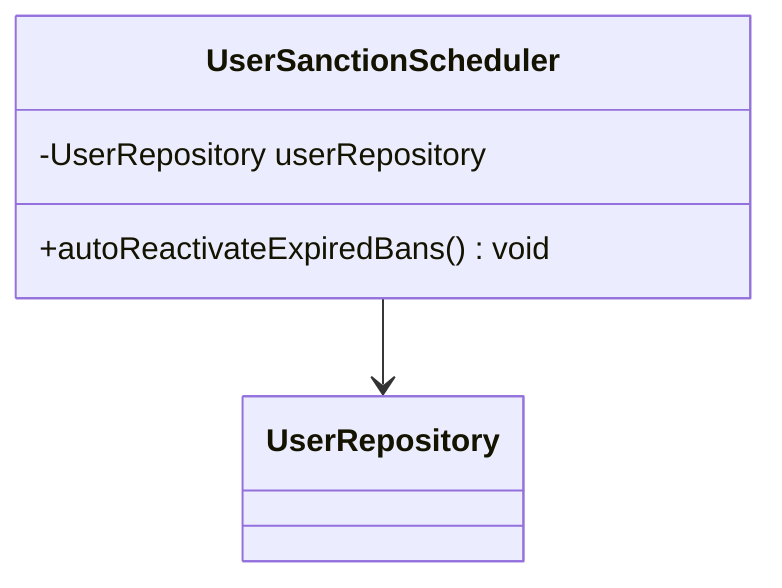
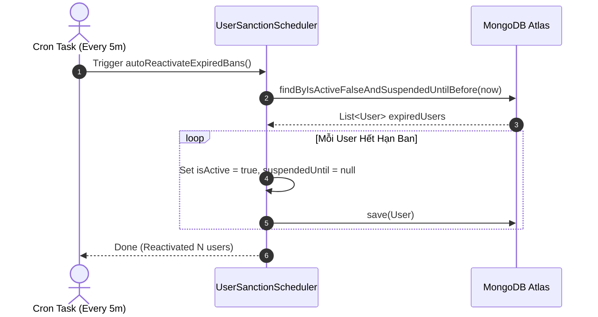

# UC-09.4 — Tự Động Mở Khóa Tài Khoản Khi Hết Hạn Ban (Auto-Reactivation Scheduler)

##  1. Bảng Mô Tả Nghiệp Vụ (Business Description Table)

| Mục | Chi Tiết Nghiệp Vụ |
|---|---|
| **Mã Use Case** | `UC-09.4` |
| **Tên Tính Năng** | Tự động khôi phục quyền truy cập tài khoản khi hết hạn tạm khóa |
| **Actor Chính** | System Scheduler (Cron Job chạy 5 phút/lần) |
| **Mục Tiêu** | Tự động quét và mở khóa cho các user có `suspendedUntil < now` |
| **API Endpoint** | `Scheduled Task (Every 5 mins)` |
| **Tiền Điều Kiện** | Tồn tại user có `isActive=false` và `suspendedUntil < now` |
| **Hậu Điều Kiện** | Chuyển `isActive=true`, reset `suspendedUntil=null` |
| **Quy Tắc Nghiệp Vụ** | Vận hành ngầm tự động không cần sự can thiệp thủ công của Admin |
| **Các Mã Lỗi Có Thể Gặp** | Không có |

---

##  2. Class Diagram

---

##  3. Sequence Diagram

---

##  4. Testing & Verification Report

- **Test Suite Class:** `com.mchub.services.UserSanctionSchedulerTest`
- **Method Kiểm Thử:** `autoReactivateExpiredBans_reactivatesEligibleUsers()`
- **Assertions:** User quá hạn tạm khóa được khôi phục `isActive = true`.
