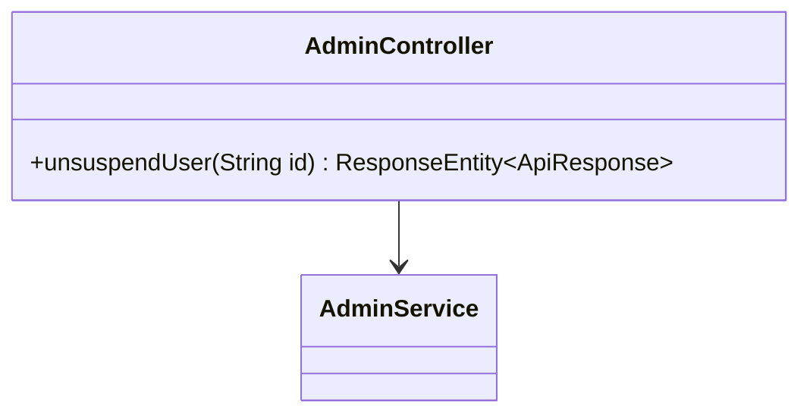
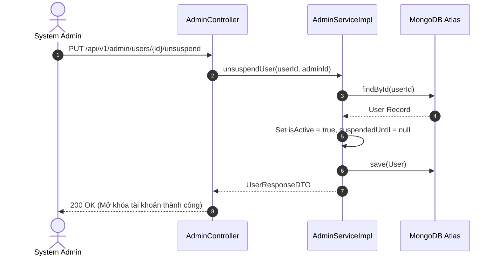

# UC-09.5 — Mở Khóa Tài Khoản Thủ Công (Manual Unsuspend)

##  1. Bảng Mô Tả Nghiệp Vụ (Business Description Table)

| Mục | Chi Tiết Nghiệp Vụ |
|---|---|
| **Mã Use Case** | `UC-09.5` |
| **Tên Tính Năng** | Mở khóa truy cập tài khoản bị ban trước thời hạn |
| **Actor Chính** | Admin |
| **Mục Tiêu** | Khôi phục `isActive=true` lập tức theo quyết định của Admin |
| **API Endpoint** | `PUT /api/v1/admin/users/{id}/unsuspend` |
| **Tiền Điều Kiện** | User đang ở trạng thái bị khóa (`isActive=false`) |
| **Hậu Điều Kiện** | Set `isActive=true`, `suspendedUntil=null`, thêm `sanctionHistory` UNSUSPEND |
| **Quy Tắc Nghiệp Vụ** | Cho phép đền bù hoặc giải quyết khiếu nại unban sớm |
| **Các Mã Lỗi Có Thể Gặp** | `USER_NOT_FOUND` (404) |

---

##  2. Class Diagram

---

##  3. Sequence Diagram

---

##  4. Testing & Verification Report

- **Test Suite Class:** `com.mchub.services.impl.AdminServiceImplTest`
- **Method Kiểm Thử:** `unsuspendUser_success()`
- **Assertions:** `user.isActive == true`, `user.suspendedUntil == null`.
