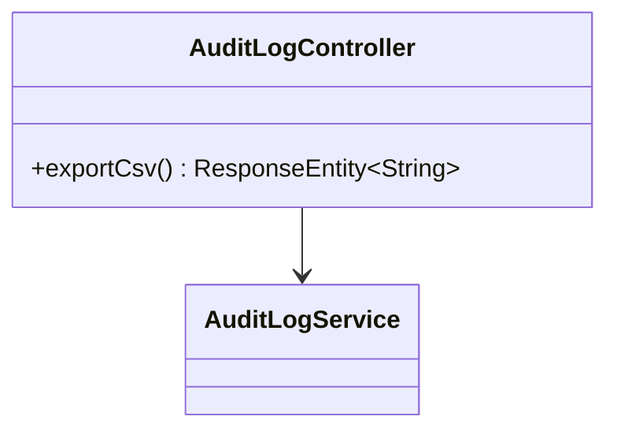
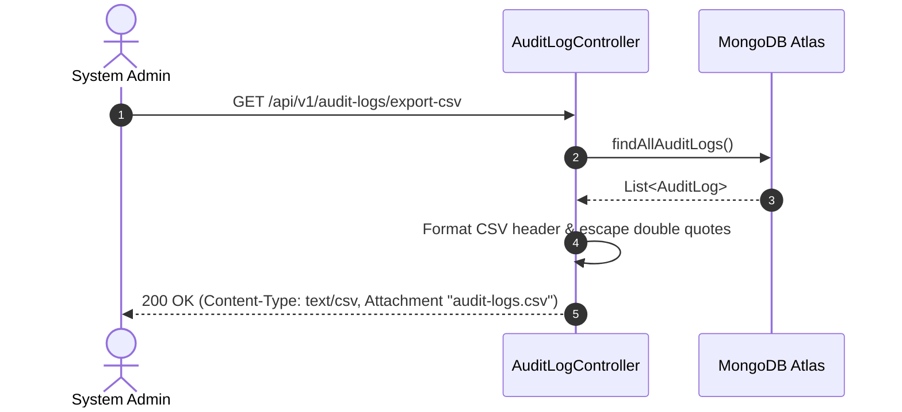

# UC-09.6 — Xuất File CSV Audit Log (Export Audit Log CSV)

##  1. Bảng Mô Tả Nghiệp Vụ (Business Description Table)

| Mục | Chi Tiết Nghiệp Vụ |
|---|---|
| **Mã Use Case** | `UC-09.6` |
| **Tên Tính Năng** | Tải xuống toàn bộ nhật ký an ninh hệ thống dạng CSV |
| **Actor Chính** | Admin |
| **Mục Tiêu** | Trả về stream file CSV chứa lịch sử thao tác của Admin và User |
| **API Endpoint** | `GET /api/v1/audit-logs/export-csv` |
| **Tiền Điều Kiện** | Quyền `ROLE_ADMIN` |
| **Hậu Điều Kiện** | Trả về file stream `text/csv` với attachment filename `audit-logs.csv` |
| **Quy Tắc Nghiệp Vụ** | Format các cột `ID,CreatedAt,UserId,Action,Resource,ResourceId,IP,Details` |
| **Các Mã Lỗi Có Thể Gặp** | `FORBIDDEN` (403) |

---

##  2. Class Diagram

---

##  3. Sequence Diagram

---

##  4. Testing & Verification Report

- **Test Suite Class:** `com.mchub.controllers.AuditLogControllerTest`
- **Method Kiểm Thử:** `exportCsv_returnsValidCsvStream()`
- **Assertions:** Content-Type là `text/csv`, header chứa đủ 8 trường thông tin.
