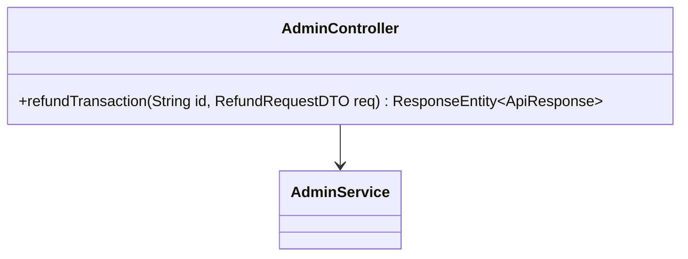
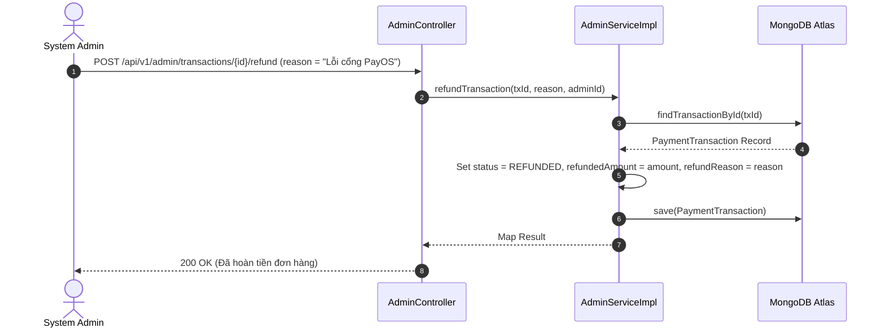

# UC-09.7 — Hoàn Tiền Giao Dịch Nâng Cấp VIP (Refund Transaction)

##  1. Bảng Mô Tả Nghiệp Vụ (Business Description Table)

| Mục | Chi Tiết Nghiệp Vụ |
|---|---|
| **Mã Use Case** | `UC-09.7` |
| **Tên Tính Năng** | Đánh dấu hoàn tiền cho đơn hàng giao dịch thanh toán |
| **Actor Chính** | Admin |
| **Mục Tiêu** | Đổi `status = TransactionStatus.REFUNDED`, ghi số tiền hoàn và lý do đền bù |
| **API Endpoint** | `POST /api/v1/admin/transactions/{id}/refund` |
| **Tiền Điều Kiện** | Giao dịch tồn tại và có `status = PAID` |
| **Hậu Điều Kiện** | Update status `REFUNDED`, lưu `refundReason`, `refundedAt`, `refundedBy` |
| **Quy Tắc Nghiệp Vụ** | Lý do hoàn tiền rỗng sẽ lấy mặc định "Refunded by Administrator" |
| **Các Mã Lỗi Có Thể Gặp** | `TRANSACTION_NOT_FOUND` (404), `TRANSACTION_NOT_PAID` (400) |

---

##  2. Class Diagram

---

##  3. Sequence Diagram

---

##  4. Testing & Verification Report

- **Test Suite Class:** `com.mchub.services.impl.AdminServiceImplTest`
- **Method Kiểm Thử:** `refundTransaction_success()`
- **Assertions:** Status chuyển thành `REFUNDED`, `refundReason` lưu đúng nội dung.
