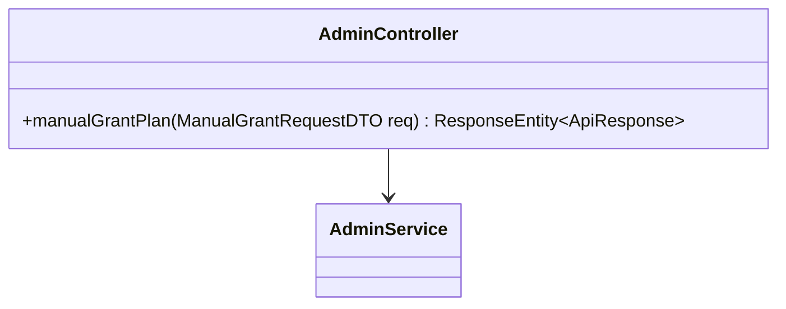
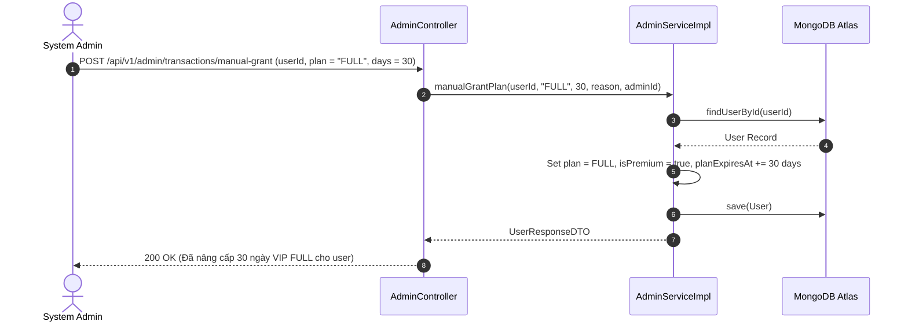

# UC-09.8 — Cấp Tặng Gói VIP Thủ Công (Manual Grant VIP Plan)

## 📋 1. Bảng Mô Tả Nghiệp Vụ (Business Description Table)

| Mục | Chi Tiết Nghiệp Vụ |
|---|---|
| **Mã Use Case** | `UC-09.8` |
| **Tên Tính Năng** | Cấp tặng gói cước VIP thủ công cho học viên |
| **Actor Chính** | Admin |
| **Mục Tiêu** | Nâng cấp `User.plan` (BASIC / FULL / ANNUAL) và cộng thêm số ngày VIP chỉ định |
| **API Endpoint** | `POST /api/v1/admin/transactions/manual-grant` |
| **Tiền Điều Kiện** | Quyền `ROLE_ADMIN`, User tồn tại |
| **Hậu Điều Kiện** | Gia hạn `planExpiresAt += days`, `isPremium = true` |
| **Quy Tắc Nghiệp Vụ** | Nếu `planExpiresAt` hiện tại đã hết hạn thì tính cộng bắt đầu từ `now` |
| **Các Mã Lỗi Có Thể Gặp** | `USER_NOT_FOUND` (404), `INVALID_PLAN` (400) |

---

## 📐 2. Class Diagram

---

## 🔄 3. Sequence Diagram

---

## 🧪 4. Testing & Verification Report

- **Test Suite Class:** `com.mchub.services.impl.AdminServiceImplTest`
- **Method Kiểm Thử:** `manualGrantPlan_success()`
- **Assertions:** `user.plan` chuyển sang `FULL`, `planExpiresAt` được cộng 30 ngày.
