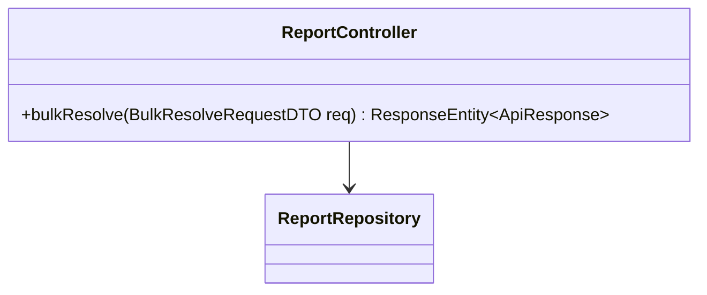
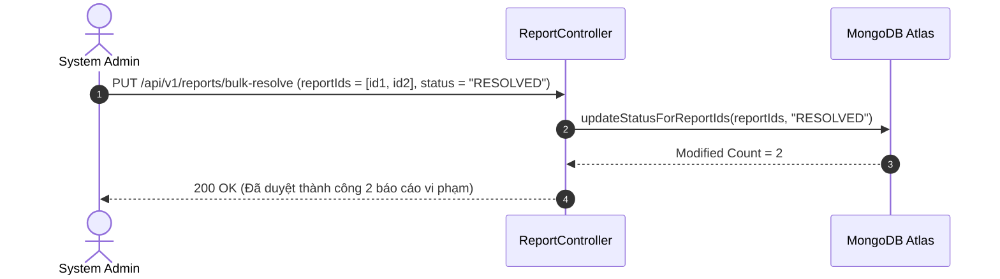

# UC-09.9 — Duyệt & Xử Lý Báo Cáo Vi Phạm Hàng Loạt (Bulk Resolve Reports)

##  1. Bảng Mô Tả Nghiệp Vụ (Business Description Table)

| Mục | Chi Tiết Nghiệp Vụ |
|---|---|
| **Mã Use Case** | `UC-09.9` |
| **Tên Tính Năng** | Duyệt (Resolve) hoặc Bỏ qua (Dismiss) nhiều báo cáo vi phạm cùng lúc |
| **Actor Chính** | Admin |
| **Mục Tiêu** | Cập nhật trạng thái cho danh sách các report IDs |
| **API Endpoint** | `PUT /api/v1/reports/bulk-resolve` |
| **Tiền Điều Kiện** | Danh sách `reportIds` không rỗng |
| **Hậu Điều Kiện** | Cập nhật trạng thái báo cáo thành `RESOLVED` hoặc `DISMISSED` |
| **Quy Tắc Nghiệp Vụ** | Thực thi batch update trong Database để nâng cao hiệu năng |
| **Các Mã Lỗi Có Thể Gặp** | `EMPTY_REPORT_IDS` (400) |

---

##  2. Class Diagram

---

##  3. Sequence Diagram

---

##  4. Testing & Verification Report

- **Test Suite Class:** `com.mchub.controllers.ReportControllerTest`
- **Method Kiểm Thử:** `bulkResolve_validIds_updatesStatus()`
- **Assertions:** Tất cả report ID trong danh sách chuyển sang trạng thái `RESOLVED`.
