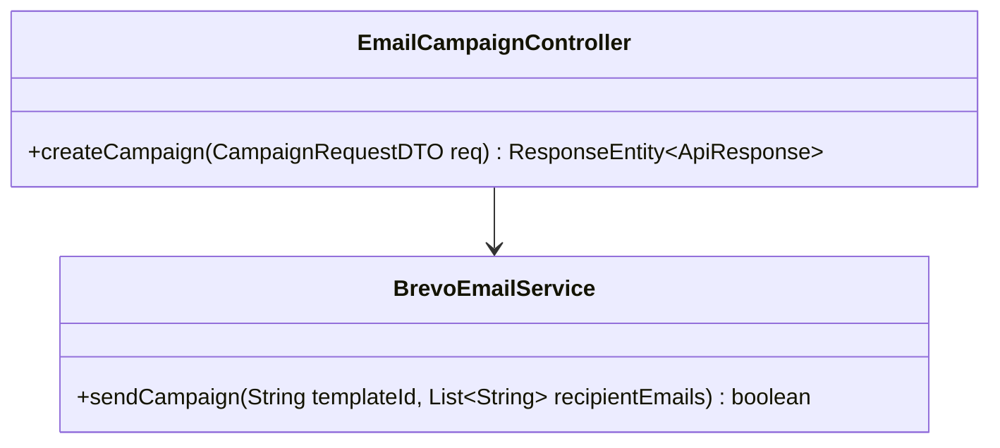
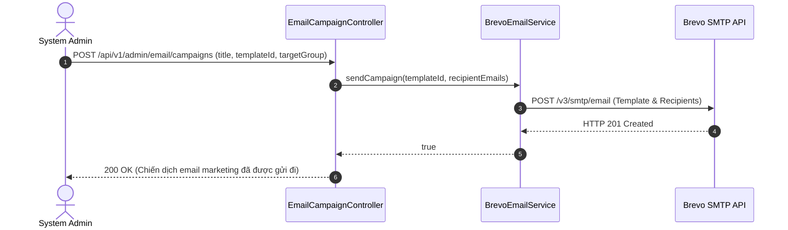

# UC-10.1 — Tạo Chiến Dịch Email Marketing (Create Email Campaign)

##  1. Bảng Mô Tả Nghiệp Vụ (Business Description Table)

| Mục | Chi Tiết Nghiệp Vụ |
|---|---|
| **Mã Use Case** | `UC-10.1` |
| **Tên Tính Năng** | Tạo và phát hành chiến dịch Email Marketing hàng loạt |
| **Actor Chính** | Admin |
| **Mục Tiêu** | Gửi email thông báo/khuyến mãi qua Brevo SMTP tới nhóm học viên chọn lọc |
| **API Endpoint** | `POST /api/v1/admin/email/campaigns` |
| **Tiền Điều Kiện** | Quyền `ROLE_ADMIN`, Template ID Brevo tồn tại |
| **Hậu Điều Kiện** | Phát hành chiến dịch gửi email hàng loạt thành công |
| **Quy Tắc Nghiệp Vụ** | Xử lý bất đồng bộ (Asynchronous) để không làm nghẽn thread Admin |
| **Các Mã Lỗi Có Thể Gặp** | `BREVO_API_FAILED` (500) |

---

##  2. Class Diagram

---

##  3. Sequence Diagram

---

##  4. Testing & Verification Report

- **Test Suite Class:** `com.mchub.controllers.EmailCampaignControllerTest`
- **Method Kiểm Thử:** `createCampaign_validPayload_sendsEmails()`
- **Assertions:** API Brevo được gọi đúng tham số `templateId`.
