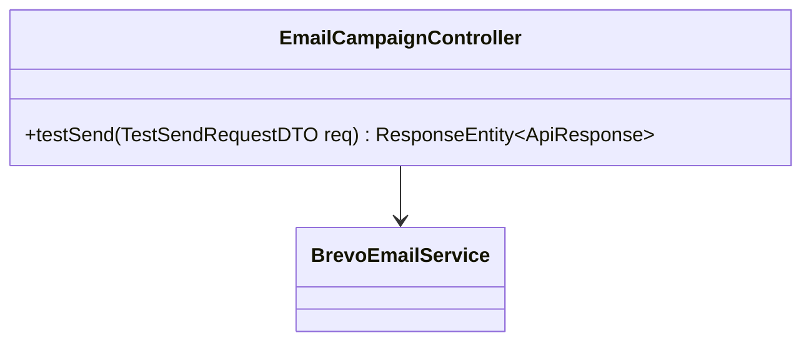
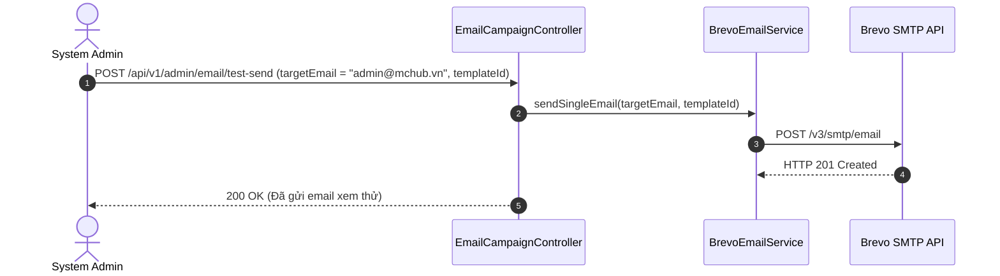

# UC-10.2 — Gửi Thử Email Kiểm Tra (Test Send Email)

## 📋 1. Bảng Mô Tả Nghiệp Vụ (Business Description Table)

| Mục | Chi Tiết Nghiệp Vụ |
|---|---|
| **Mã Use Case** | `UC-10.2` |
| **Tên Tính Năng** | Gửi email kiểm tra thử nghiệm giao diện template |
| **Actor Chính** | Admin |
| **Mục Tiêu** | Gửi 1 email duy nhất đến địa chỉ Admin để xem trước layout trước khi phát hành |
| **API Endpoint** | `POST /api/v1/admin/email/test-send` |
| **Tiền Điều Kiện** | Email nhận không rỗng và đúng định dạng |
| **Hậu Điều Kiện** | Gửi thành công 1 email qua Brevo SMTP |
| **Quy Tắc Nghiệp Vụ** | Giúp Admin duyệt giao diện mẫu email chuẩn |
| **Các Mã Lỗi Có Thể Gặp** | `INVALID_EMAIL` (400) |

---

## 📐 2. Class Diagram

---

## 🔄 3. Sequence Diagram

---

## 🧪 4. Testing & Verification Report

- **Test Suite Class:** `com.mchub.controllers.EmailCampaignControllerTest`
- **Method Kiểm Thử:** `testSend_success()`
- **Assertions:** Trả về HTTP 200 OK.
