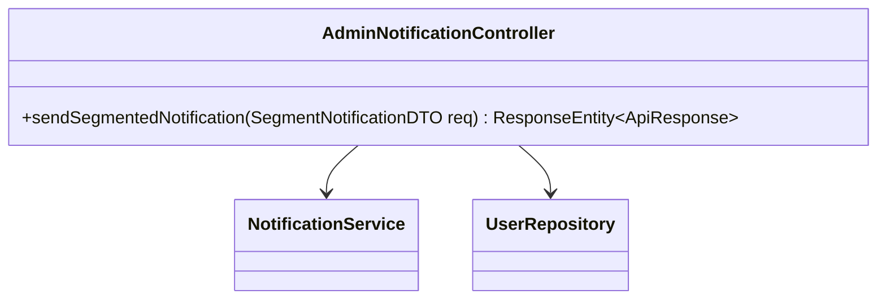
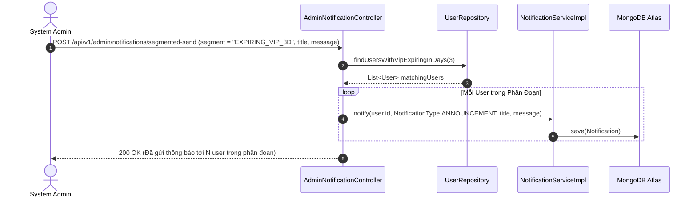

# UC-10.3 — Gửi Thông Báo Phân Đoạn Đối Tượng (Segmented Push Notifications)

##  1. Bảng Mô Tả Nghiệp Vụ (Business Description Table)

| Mục | Chi Tiết Nghiệp Vụ |
|---|---|
| **Mã Use Case** | `UC-10.3` |
| **Tên Tính Năng** | Gửi thông báo đẩy phân đoạn theo tệp học viên mục tiêu |
| **Actor Chính** | Admin |
| **Mục Tiêu** | Gửi thông báo tới phân đoạn `EXPIRING_VIP_3D`, `DORMANT_14D`, hoặc `ALL` |
| **API Endpoint** | `POST /api/v1/admin/notifications/segmented-send` |
| **Tiền Điều Kiện** | Quyền `ROLE_ADMIN` |
| **Hậu Điều Kiện** | Lưu bản ghi `Notification` trong DB cho tất cả các user thuộc phân đoạn |
| **Quy Tắc Nghiệp Vụ** | Tự động lọc danh sách user khớp với tiêu chí của segment trước khi gửi |
| **Các Mã Lỗi Có Thể Gặp** | `INVALID_SEGMENT` (400) |

---

##  2. Class Diagram

---

##  3. Sequence Diagram

---

##  4. Testing & Verification Report

- **Test Suite Class:** `com.mchub.controllers.AdminNotificationControllerTest`
- **Method Kiểm Thử:** `sendSegmentedNotification_expiringVip_sendsToMatchingUsers()`
- **Assertions:** Lọc chính xác danh sách user và gọi `notificationService.notify()`.
