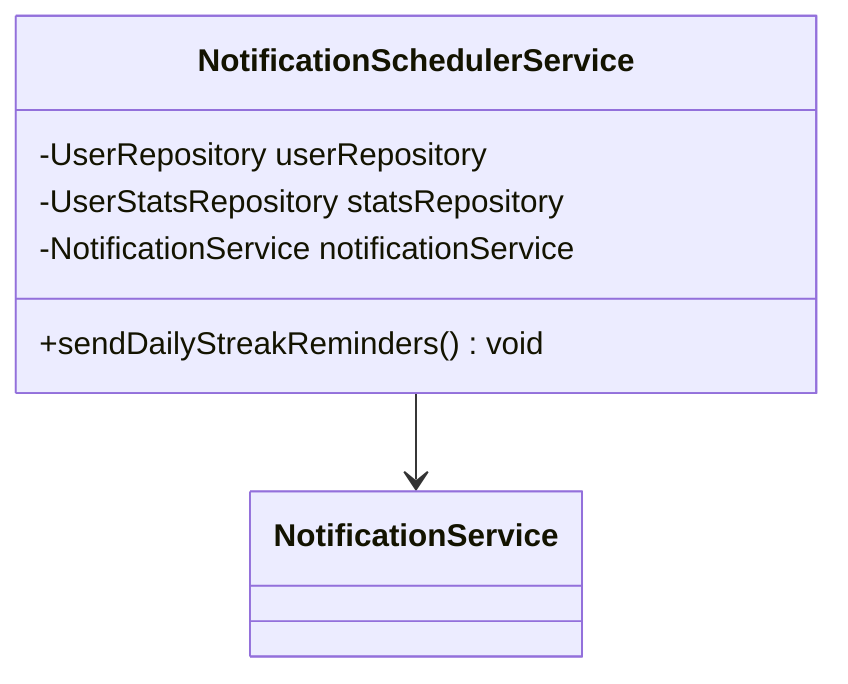
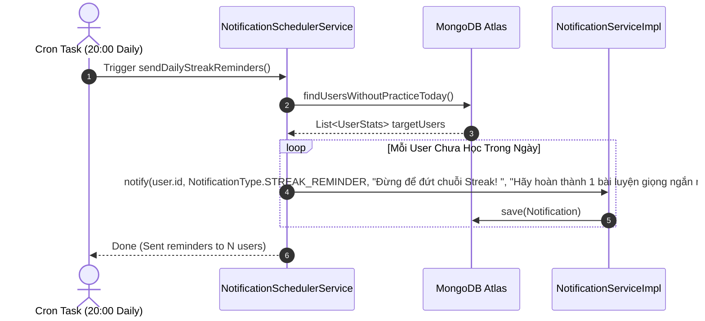

# UC-10.4 — Nhắc Nhở Streak Tự Động Hàng Ngày (Daily Streak Reminder Scheduler)

##  1. Bảng Mô Tả Nghiệp Vụ (Business Description Table)

| Mục | Chi Tiết Nghiệp Vụ |
|---|---|
| **Mã Use Case** | `UC-10.4` |
| **Tên Tính Năng** | Tự động gửi thông báo nhắc nhở giữ chuỗi Streak lúc 20:00 mỗi ngày |
| **Actor Chính** | System Scheduler (Cron Job) |
| **Mục Tiêu** | Nhắc học viên chưa học bài trong ngày hoàn thành 1 bài tập trước 24h để không đứt Streak |
| **API Endpoint** | `Scheduled Task (Daily at 20:00)` |
| **Tiền Điều Kiện** | User chưa có phiên `PracticeSession` nào được tạo trong ngày |
| **Hậu Điều Kiện** | Tạo `Notification` loại `STREAK_REMINDER` cho từng user |
| **Quy Tắc Nghiệp Vụ** | Chạy tự động lúc 20:00 qua Cron `@Scheduled(cron = "0 0 20 * * *")` |
| **Các Mã Lỗi Có Thể Gặp** | Không có |

---

##  2. Class Diagram

---

##  3. Sequence Diagram

---

##  4. Testing & Verification Report

- **Test Suite Class:** `com.mchub.services.NotificationSchedulerServiceTest`
- **Method Kiểm Thử:** `sendDailyStreakReminders_sendsToUsersWithoutPracticeToday()`
- **Assertions:** Gửi thông báo đúng tới danh sách user chưa luyện tập trong ngày.
