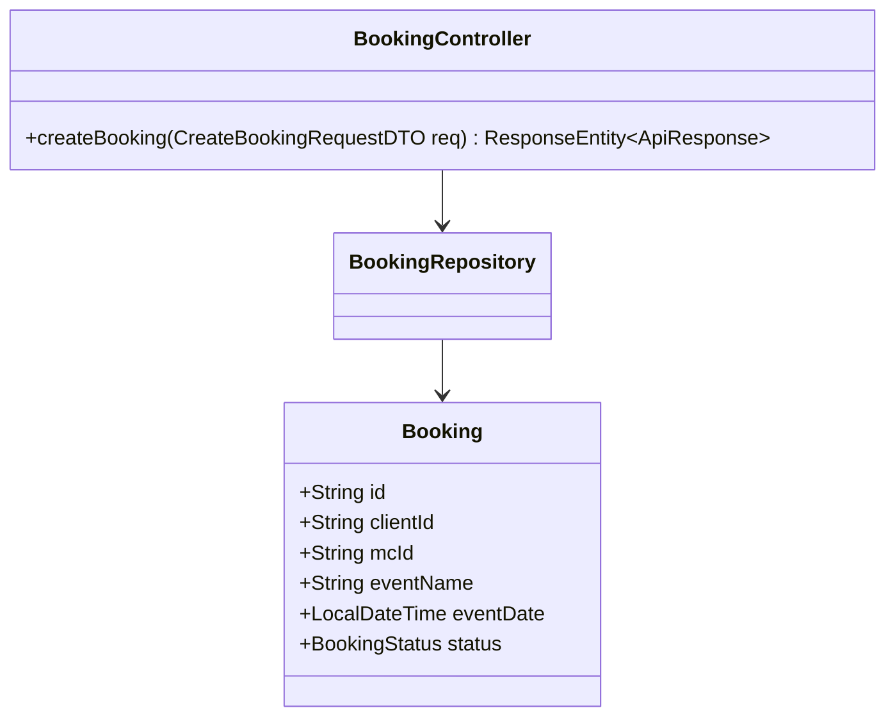
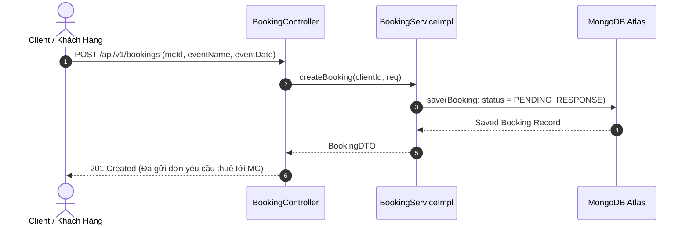

# UC-11.1 — Tạo Đơn Đặt Lịch MC (Create Booking Request)

##  1. Bảng Mô Tả Nghiệp Vụ (Business Description Table)

| Mục | Chi Tiết Nghiệp Vụ |
|---|---|
| **Mã Use Case** | `UC-11.1` |
| **Tên Tính Năng** | Tạo đơn yêu cầu thuê MC sự kiện |
| **Actor Chính** | Client (Khách hàng thuê MC) |
| **Mục Tiêu** | Gửi thông tin sự kiện (tên sự kiện, thời gian, vị trí) cho MC chọn |
| **API Endpoint** | `POST /api/v1/bookings` |
| **Tiền Điều Kiện** | MC đang mở lịch nhận đơn (`isAvailable=true`) |
| **Hậu Điều Kiện** | Lưu `Booking` ở trạng thái `PENDING_RESPONSE` |
| **Quy Tắc Nghiệp Vụ** | Thời gian sự kiện phải trong tương lai (`eventDate > now`) |
| **Các Mã Lỗi Có Thể Gặp** | `MC_UNAVAILABLE` (400), `INVALID_EVENT_DATE` (400) |

---

##  2. Class Diagram

---

##  3. Sequence Diagram

---

##  4. Testing & Verification Report

- **Test Suite Class:** `com.mchub.services.impl.BookingServiceImplTest`
- **Method Kiểm Thử:** `createBooking_validRequest_createsPendingBooking()`
- **Assertions:** Đơn hàng được lưu với trạng thái `PENDING_RESPONSE`.
