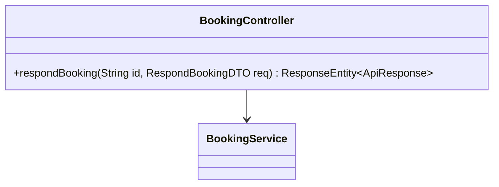
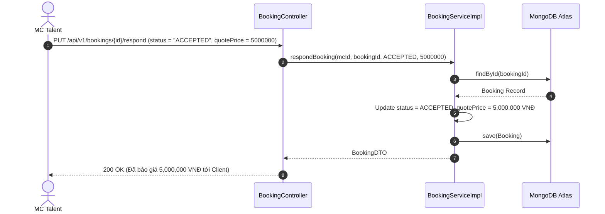

# UC-11.2 — MC Phản Hồi & Báo Giá (MC Respond & Quote Price)

##  1. Bảng Mô Tả Nghiệp Vụ (Business Description Table)

| Mục | Chi Tiết Nghiệp Vụ |
|---|---|
| **Mã Use Case** | `UC-11.2` |
| **Tên Tính Năng** | MC phản hồi đơn yêu cầu và Báo giá dịch vụ |
| **Actor Chính** | MC Talent |
| **Mục Tiêu** | Chấp nhận (`ACCEPTED`) kèm số tiền báo giá (VNĐ) hoặc Từ chối (`REJECTED`) |
| **API Endpoint** | `PUT /api/v1/bookings/{id}/respond` |
| **Tiền Điều Kiện** | Đơn đặt lịch đang ở trạng thái `PENDING_RESPONSE` |
| **Hậu Điều Kiện** | Cập nhật `Booking.status` và `quotePrice` |
| **Quy Tắc Nghiệp Vụ** | Mức giá báo phải >= 0 |
| **Các Mã Lỗi Có Thể Gặp** | `BOOKING_NOT_FOUND` (404), `UNAUTHORIZED_MC` (403) |

---

##  2. Class Diagram

---

##  3. Sequence Diagram

---

##  4. Testing & Verification Report

- **Test Suite Class:** `com.mchub.services.impl.BookingServiceImplTest`
- **Method Kiểm Thử:** `respondBooking_accepted_updatesStatusAndQuotePrice()`
- **Assertions:** `quotePrice` được gán đúng số tiền, status chuyển thành `ACCEPTED`.
