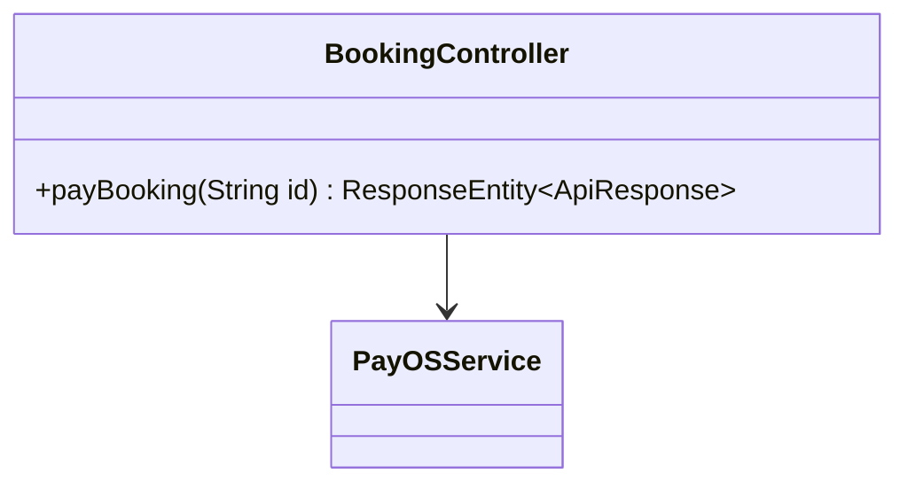
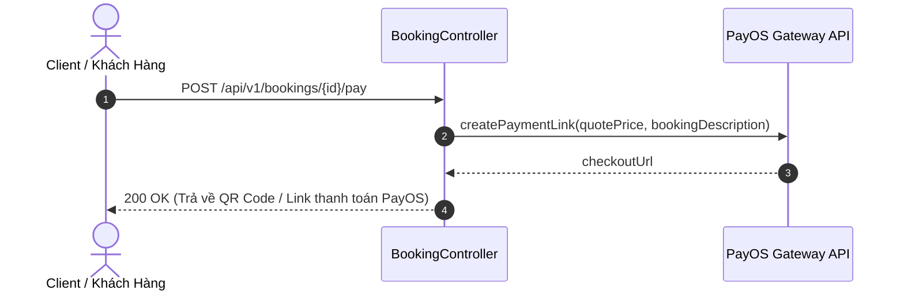

# UC-11.3 — Thanh Toán Đơn Đặt MC PayOS (Pay Booking Order)

##  1. Bảng Mô Tả Nghiệp Vụ (Business Description Table)

| Mục | Chi Tiết Nghiệp Vụ |
|---|---|
| **Mã Use Case** | `UC-11.3` |
| **Tên Tính Năng** | Thanh toán tiền thuê MC qua cổng PayOS |
| **Actor Chính** | Client |
| **Mục Tiêu** | Sinh link thanh toán PayOS QR Code theo mức giá `quotePrice` |
| **API Endpoint** | `POST /api/v1/bookings/{id}/pay` |
| **Tiền Điều Kiện** | Đơn hàng đang ở trạng thái `ACCEPTED` |
| **Hậu Điều Kiện** | Trả về `checkoutUrl` PayOS cho Client thanh toán |
| **Quy Tắc Nghiệp Vụ** | Đơn hàng giữ chỗ sau khi được thanh toán thành công |
| **Các Mã Lỗi Có Thể Gặp** | `BOOKING_NOT_ACCEPTED` (400), `PAYOS_SERVICE_FAILED` (500) |

---

##  2. Class Diagram

---

##  3. Sequence Diagram

---

##  4. Testing & Verification Report

- **Test Suite Class:** `com.mchub.controllers.BookingControllerTest`
- **Method Kiểm Thử:** `payBooking_returnsPaymentLink()`
- **Assertions:** Trả về `checkoutUrl` PayOS hợp lệ.
