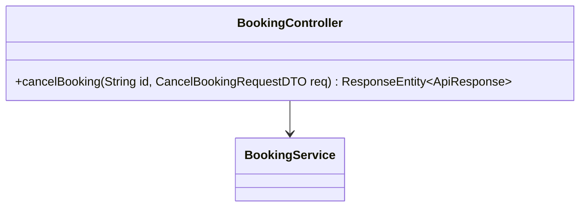
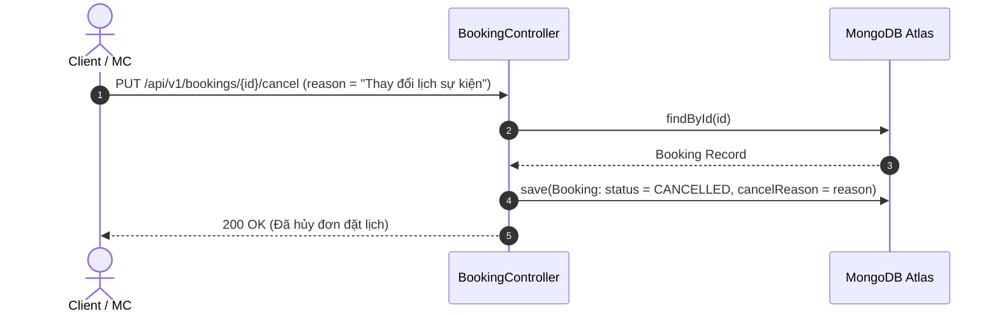

# UC-11.4 — Hủy Đơn Đặt Lịch MC (Cancel Booking)

##  1. Bảng Mô Tả Nghiệp Vụ (Business Description Table)

| Mục | Chi Tiết Nghiệp Vụ |
|---|---|
| **Mã Use Case** | `UC-11.4` |
| **Tên Tính Năng** | Hủy đơn đặt lịch MC sự kiện |
| **Actor Chính** | Client / MC |
| **Mục Tiêu** | Hủy đơn trước ngày diễn ra sự kiện |
| **API Endpoint** | `PUT /api/v1/bookings/{id}/cancel` |
| **Tiền Điều Kiện** | Đơn hàng chưa ở trạng thái `COMPLETED` |
| **Hậu Điều Kiện** | Update status `CANCELLED`, lưu `cancelReason` |
| **Quy Tắc Nghiệp Vụ** | Hủy trước 24h sự kiện được hoàn lại 100% tiền giữ chỗ |
| **Các Mã Lỗi Có Thể Gặp** | `CANNOT_CANCEL_COMPLETED_BOOKING` (400) |

---

##  2. Class Diagram

---

##  3. Sequence Diagram

---

##  4. Testing & Verification Report

- **Test Suite Class:** `com.mchub.services.impl.BookingServiceImplTest`
- **Method Kiểm Thử:** `cancelBooking_updatesStatus()`
- **Assertions:** Status chuyển thành `CANCELLED`.
