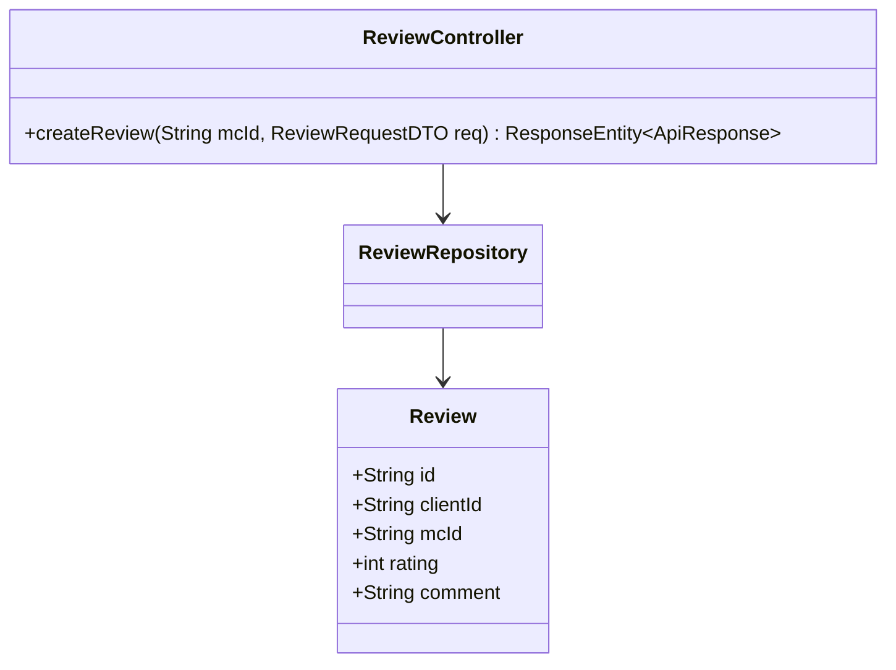
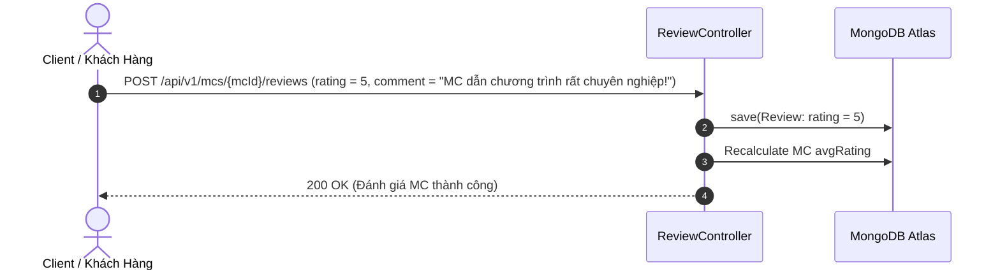

# UC-11.5 — Đánh Giá & Chấm Điểm MC (Review MC Talent)

## 📋 1. Bảng Mô Tả Nghiệp Vụ (Business Description Table)

| Mục | Chi Tiết Nghiệp Vụ |
|---|---|
| **Mã Use Case** | `UC-11.5` |
| **Tên Tính Năng** | Đánh giá và chấm điểm sao cho MC sau sự kiện |
| **Actor Chính** | Client |
| **Mục Tiêu** | Viết nhận xét và chấm 1-5 sao cho MC sau khi đơn hoàn thành |
| **API Endpoint** | `POST /api/v1/mcs/{mcId}/reviews` |
| **Tiền Điều Kiện** | Client từng có ít nhất 1 đơn đặt lịch đã `COMPLETED` với MC đó |
| **Hậu Điều Kiện** | Lưu `Review` và cập nhật lại điểm `avgRating` của MC |
| **Quy Tắc Nghiệp Vụ** | Đánh giá sao từ 1 đến 5. Mỗi đơn đặt chỉ được viết 1 review |
| **Các Mã Lỗi Có Thể Gặp** | `NO_COMPLETED_BOOKING` (400), `INVALID_RATING` (400) |

---

## 📐 2. Class Diagram

---

## 🔄 3. Sequence Diagram

---

## 🧪 4. Testing & Verification Report

- **Test Suite Class:** `com.mchub.controllers.ReviewControllerTest`
- **Method Kiểm Thử:** `createReview_success_updatesMcAvgRating()`
- **Assertions:** Rating trung bình của MC được cập nhật chính xác trong DB.
